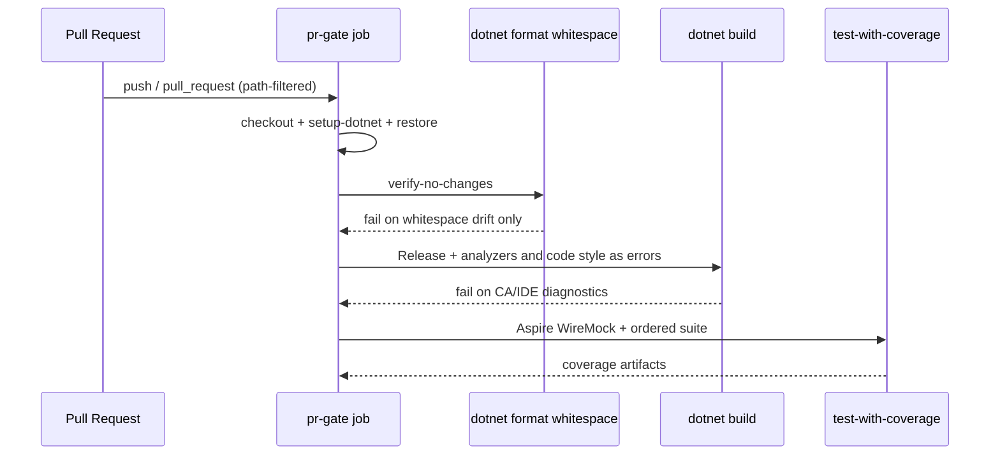

# AGENTS.md — CI / PR Gate

## TL;DR

The PR gate is a single-job workflow that restores, checks whitespace, builds with .NET analyzers as errors, and runs the ordered test suite; path filters currently skip docs-only PRs and must include build-config files or analyzer/format changes will not run.

## Non-Negotiables

- Keep the PR gate as **one job** until WT-10-02 restructures test execution — do not fan format/build/test into parallel jobs here.
- Analyzer enablement lives in `Directory.Build.props`; enforced severities live in `.editorconfig`. Do not silence rules with blanket `NoWarn` or `#pragma warning disable` — narrow the rule in `.editorconfig` with a reason comment, or fix the code.
- The Format step is `dotnet format **whitespace**`, deliberately. Bare `dotnet format` also runs the style and analyzer passes, which would make analyzer violations fail on Format before Build ever runs and collapse two distinct signals into one step. Do not drop the `whitespace` subcommand.
- `AnalysisLevel` is pinned to a version (`10.0-recommended`), not `latest-recommended`. With `TreatWarningsAsErrors=true` a floating level lets an SDK bump break `main` with no repository change. Raising it is a deliberate edit.
- `TreatWarningsAsErrors=true` stays on. A green Build step means zero analyzer/style diagnostics at the enforced severities.
- Do not add NetArchTest or other architecture-boundary packages in this surface — that is WT-10-02 (NFR-090 hand-off).
- Path-filter edits for build-config files are scoped; do not delete the `paths:` blocks to make the gate always-run (that is Gap A of WT-10-04).

## System Context

GitHub Actions owns the quality gate for every merge to `main`. The workflow installs the .NET SDK, restores the solution, verifies whitespace, builds Release with SDK analyzers and code style as errors, then runs the composite Aspire/WireMock test action and publishes coverage. Local agents must be able to reproduce the same gates without GitHub (`dotnet format whitespace`, `dotnet build -c Release`).

## Architecture Decisions

### LADR-019 — Direct ILogger calls over LoggerMessage delegates

**Status:** Accepted. Enabling the analyzer gate surfaced CA1848 on every `ILogger.Log*` call — twenty diagnostics across roughly ten Infrastructure sites (startup seed, retention, unit-of-work rollback), none of them hot paths. `dotnet_diagnostic.CA1848.severity = suggestion` keeps explicit call sites rather than source-generated `LoggerMessage` partials, whose declaration-plus-generated-implementation indirection is what NFR-092 disfavours. Backend logging conventions stay concerned with level selection, not mechanism; a genuinely hot path can adopt `LoggerMessage` deliberately without flipping the repository severity. See [LADR-019](../docs/hlds/mvp/ladrs/019-direct-ilogger-calls-over-loggermessage.md).

## Key Behaviors

- **Two distinct signals, two steps.** Whitespace drift fails Format; CA and IDE diagnostics fail Build. This only holds because Format runs the `whitespace` subcommand — bare `dotnet format` runs style and analyzer passes too, and since it precedes Build it would swallow every analyzer failure into the Format step. Local equivalent: `dotnet format whitespace smooth-ai-stockanalysis.slnx --verify-no-changes`.
- **CA1711 is narrowed, not disabled.** `dotnet_code_quality.CA1711.allowed_suffixes = Collection` exists for xUnit's `[CollectionDefinition]` convention (`AspireCollection`). The rule stays at `warning`, so `Queue` / `Stack` / `Ex` / `Impl` suffixes are still rejected across `src/`. Do not replace this with `severity = none` — that trades a repository-wide guard for one test fixture name.
- **Path-filter trap.** `pr-gate.yml` path filters inherited from `builder-catalogue` originally omitted `Directory.Build.props`, `.editorconfig`, `.config/dotnet-tools.json`, and `*.slnx`. Changing those files alone would skip the gate. Those four paths are now included on both `push` and `pull_request`. Docs-only PRs still skip the gate — intentional until WT-10-04.
- **Severity resolution order.** SDK default → `AnalysisLevel`/`AnalysisMode` → `.editorconfig`. Reviewable policy belongs in `.editorconfig`, not hidden SDK defaults — but `.editorconfig` pins only the rules listed in it, so the pinned `AnalysisLevel` is what actually stops an SDK bump from changing the enforced set.
- **Migrations.** `Persistence/Migrations/**` is `generated_code = true` in `.editorconfig` and migration classes carry `[ExcludeFromCodeCoverage]`; analyzers skip them.
- **Hand-off to WT-10-02.** NFR-090 "layer dependency rules checked in the build" is an L0 architecture test project, not part of this workflow surface.

## Quality Constraints

- Format and analyzer gates must be runnable locally (NFR-069).
- No third-party analyzer packages (StyleCop, Sonar, Roslynator) unless a future NFR requires them — baseline is SDK analyzers only.
- Behaviour-preserving warning fixes only; analyzer cleanup must not weaken or delete tests.

## Migration Plans

- WT-10-02 will split test levels inside the same job family and add architecture boundary tests — extend this document rather than creating a second CI context.
- WT-10-03 adds secret scanning to the gate.
- WT-10-04 may make the gate always-run (remove or broaden path filters) and closes story #10.

## Changelog

| Date | Change | Ref |
|:-----|:-------|:----|
| 2026-07-25 | Created: format + analyzer gates, CA1848/CA1711 decisions, path-filter trap, WT-10-02 hand-off | #82 / WT-10-01 |
| 2026-07-25 | Review fixes: Format narrowed to `whitespace` so analyzers fail Build not Format; CA1711 narrowed via `allowed_suffixes` instead of disabled; `AnalysisLevel` pinned to `10.0-recommended`; CA1848 decision promoted to register LADR-019 | #82 / WT-10-01 |
