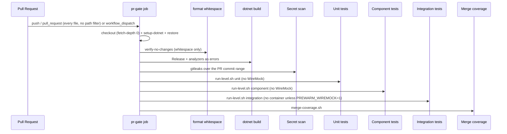
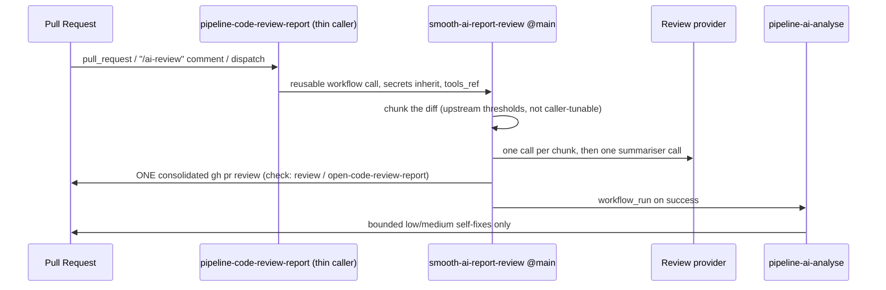

# AGENTS.md — CI / PR Gate

## TL;DR

The PR gate is a single-job workflow that runs on **every** pull request (no path filter — its job is a required status check), restores, checks whitespace, builds with .NET analyzers as errors, runs a **secret scan** (gitleaks, PR commit range) that fails on a detected credential, then runs **unit → component → integration** as three named steps (no level needs a container runtime today), merges coverage, and uploads per-level test-result artifacts, the merged coverage report, and the `secret-scan-report` artifact. Two further workflows produce the AI review: a thin caller into upstream `smooth-ai-report-review`, and a bounded low/medium self-fix loop.

## Non-Negotiables

- Keep the PR gate as **one job** with **three distinguishable test steps**. Do not collapse levels back into one composite step. Do not fan format/build into parallel jobs here (WT-10-03/04 still extend this job).
- **No level starts WireMock/Aspire by default.** `run-level.sh integration` pre-warms it only when `PREWARM_WIREMOCK=1`, and CI leaves that unset while no test opts into `AspireCollection`. Pre-warming is a latency optimisation, never a requirement — `AspireFixture` probes the well-known endpoint and starts its own AppHost when nothing answers. Do not make it unconditional: that provisions a container for zero consumers and breaks NFR-074 for every level that gains one.
- Analyzer enablement lives in `Directory.Build.props`; enforced severities live in `.editorconfig`. Do not silence rules with blanket `NoWarn` or `#pragma warning disable` — narrow the rule in `.editorconfig` with a reason comment, or fix the code.
- The Format step is `dotnet format **whitespace**`, deliberately. Bare `dotnet format` also runs the style and analyzer passes, which would make analyzer violations fail on Format before Build ever runs and collapse two distinct signals into one step. Do not drop the `whitespace` subcommand.
- `AnalysisLevel` is pinned to a version (`10.0-recommended`), not `latest-recommended`. With `TreatWarningsAsErrors=true` a floating level lets an SDK bump break `main` with no repository change. Raising it is a deliberate edit.
- `TreatWarningsAsErrors=true` stays on. A green Build step means zero analyzer/style diagnostics at the enforced severities.
- Coverage Include uses coverlet collector `[AssemblyName]Suffix` syntax on the four product-assembly name prefixes (e.g. `[SmoothAiStockAnalysis.Domain]*`); the syntax is passed to `dotnet test --collect:` and ReportGenerator consumes the resulting cobertura output. Test/architecture projects must not dilute coverage.
- **Never add a `paths:` filter to a workflow that produces a required status check.** `build-and-test`, `review / open-code-review-report` and `CodeQL` are all required by the default-branch ruleset. A workflow skipped by a path filter does not create its check run at all, so the requirement stays unreported and the pull request becomes unmergeable — it does not "skip work", it blocks the merge. `pr-gate.yml` had exactly this defect (inherited from the catalogue port) until WT-10-04 removed the filters. The Secret scan step is the second reason: a filter means unscanned paths.
- Architecture boundary enforcement lives in `tests/SmoothAiStockAnalysis.Architecture.UnitTest` (unit level). Extend those tests for new mechanical layer rules; do not re-encode them only as prose.
- **Do not pin the AI review workflows to upstream `@v1`.** It looks like the responsible choice and is not one: upstream force-moves that tag to its default-branch head on every push. Only a commit SHA pins. See LADR-021 and the AI review pipelines section.

## System Context

GitHub Actions owns the quality gate for every merge to `main`. After restore/format/build, three scripts under `.github/actions/test-with-coverage/` own test execution:

| Script | Role |
|---|---|
| `common.sh` | Shared project lists, coverage collector string, parallel runner, Aspire helpers |
| `run-level.sh <unit\|component\|integration>` | One level; local and CI entry point |
| `merge-coverage.sh` | reportgenerator over `artifacts/testresults/**` → `artifacts/coverage/` |
| `run.sh` | Compatibility wrapper that runs all three levels then merges (not used by the named CI steps) |

The AI review runs in two separate workflows, not in this job:

## Architecture Decisions

### LADR-019 — Direct ILogger calls over LoggerMessage delegates

**Status:** Accepted. Enabling the analyzer gate surfaced CA1848 on every `ILogger.Log*` call — twenty diagnostics across roughly ten Infrastructure sites (startup seed, retention, unit-of-work rollback), none of them hot paths. `dotnet_diagnostic.CA1848.severity = suggestion` keeps explicit call sites rather than source-generated `LoggerMessage` partials, whose declaration-plus-generated-implementation indirection is what NFR-092 disfavours. Backend logging conventions stay concerned with level selection, not mechanism; a genuinely hot path can adopt `LoggerMessage` deliberately without flipping the repository severity. See [LADR-019](../docs/hlds/mvp/ladrs/019-direct-ilogger-calls-over-loggermessage.md).

### LADR-020 — Per-level test execution and architecture gate

**Status:** Accepted. NFR-069/NFR-090 verification. Per-level scripts + three named CI steps; WireMock pre-warm opt-in via `PREWARM_WIREMOCK` so no level needs a container runtime; NetArchTest L0 project; parallel-within-level (~2.6× on unit); coverage Include narrowed to the four product-assembly name prefixes (Domain, Application, Infrastructure, Host). Rejected: xunit traits, slnf-only, three jobs, always-on WireMock, unconditional integration pre-warm. See [LADR-020](../docs/hlds/mvp/ladrs/020-per-level-test-execution-and-architecture-gate.md).

### LADR-021 — Live upstream call for the AI review tooling

**Status:** Accepted. The repository consumes upstream code three ways, and only naming all three makes the `@main` pin legible: the development template (one-time fork, LADR-006), `builder-catalogue` (one-time copy, then diverged and hardened), and `smooth-ai-report-review` (**live call — the code executes here**, in a job with `pull-requests: write`, `issues: write` and `secrets: inherit`). LADR-006's "no upstream tracking" is an argument about *merge cost on copied source* and does not transfer. Rejected: pin to a SHA (freezes fixes as effectively as risk, with nothing to signal staleness — kept as the revisit lever), pin to `@v1` (**rejected on evidence**: upstream force-moves that tag to `main` on every push, so it is `main` renamed), vendor the generator locally (would make the callee execute review scripts from each PR's own branch — strictly worse). See [LADR-021](../docs/hlds/mvp/ladrs/021-live-upstream-call-for-ai-review-tooling.md).

### Always-run gate over a path-filtered gate with a skip job

**Status:** Accepted (WT-10-04, Gap A). `pr-gate.yml`'s `paths:` filters were inherited verbatim from `builder-catalogue`, which has the same blind spot and offered no fix — porting a workflow ports its assumptions. Removed outright. The rejected alternative was the standard GitHub pattern for required checks with path filters: keep the filters and add a companion job reporting `build-and-test` as successful for non-code PRs. That was rejected on **security**, not cost: the companion job reports green *without running the Secret scan*, which permanently entrenches the docs/`.agents`/`.context` blind spot and puts a green tick on it — against a `Critical` NFR-043 on a public repository. It also does not satisfy T-037 ("run build and full test suite on every pull request"); it fakes the check. The usual counter-argument (runner minutes on documentation-heavy churn) does not apply here: the repository is public, so GitHub-hosted minutes are unmetered.

## Key Behaviors

- **Two distinct pre-test signals.** Whitespace drift fails Format; CA and IDE diagnostics fail Build. Local: `dotnet format whitespace smooth-ai-stockanalysis.slnx --verify-no-changes`.
- **Three distinguishable test signals.** Step names are `Unit tests`, `Component tests`, `Integration tests`. Within a level, all projects run (parallel) even if one fails; the level then fails. After Build succeeds, later levels still run when an earlier level failed (`!cancelled() && steps.build.outcome == 'success'`), so one red level does not hide another.
- **Per-level artifacts.** `test-results-unit`, `test-results-component`, `test-results-integration`, plus merged `coverage-report`.
- **CA1711 is narrowed, not disabled.** `dotnet_code_quality.CA1711.allowed_suffixes = Collection` exists for xUnit's `[CollectionDefinition]` convention (`AspireCollection`). Do **not** replace this with `severity = none` — that trades a repository-wide guard for one test fixture name. The rule stays at `warning`, so `Queue` / `Stack` / `Ex` / `Impl` suffixes are still rejected across `src/`.
- **Required status checks bind the trigger design.** The default-branch ruleset (`gh api repos/{owner}/{repo}/rulesets` — readable even where `.../branches/main/protection` returns 403) requires `build-and-test`, `review / open-code-review-report` and `CodeQL`, and enforces squash-only merges, one approving review, and resolved review threads. Any workflow producing one of those checks must run unconditionally on `pull_request`.
- **Always-run gate — verified, not assumed.** The before/after pair is a matched pair, so the removal is what changed the outcome: PR #272 (`.agents/**` only, filters still in place) has **no `build-and-test` check on it at all**; PR #274 (`docs/wiki/ci.md` only, filters removed) runs the full 16-step gate. Do not re-derive this — re-open the two pull requests if the claim is ever doubted.
- **Every pull request now needs an `*AGENTS.md` change — including documentation-only ones.** This is a second-order consequence of removing the path filters and it will bite an agent that does not expect it. `review / open-code-review-report` runs on every PR now, and the caller leaves upstream's `disable_agents_md_check` at its `0` default, so a FULL review posts `CHANGES_REQUESTED` on any PR that adds or modifies no `*AGENTS.md` / `README.md` / `SKILL.md`. The required *check* still passes — it is the posted review that blocks — so this shows up as an approved-checks PR that will not merge. Observed on PR #274. It enforces the root `AGENTS.md` rule ("every PR should create or update at least one `*AGENTS.md`") that the old path filter used to let non-code PRs skip. Satisfy it with a real context update; touching a file to clear the gate is gaming it. If the friction is ever unwanted, the levers are the caller's `disable_agents_md_check: 1` or `agents_md_exempt_paths` (whitespace-separated in the consuming script, despite the upstream description saying pipe-separated).
- **Migrations.** `Persistence/Migrations/**` is `generated_code = true` in `.editorconfig` and migration classes carry `[ExcludeFromCodeCoverage]`.
- **Parallel-within-level.** Catalogue pattern (`run &` + `wait` + `record_failure`). Safe because `SqliteTestDatabase` allocates `Guid`-named files per process. Measured on the unit level: 9.3 s sequential → 3.5 s parallel (~2.6×).
- **Aspire cleanup.** When pre-warming is enabled the integration level traps EXIT/INT/TERM, SIGTERM→wait→SIGKILL, then sweeps leftovers with `docker ps -aq --filter name=^wiremock`. Match by **prefix**: Aspire names the resource `wiremock-<suffix>`, so the previous fixed `docker rm -f wiremock` never matched anything and the safety net was a silent no-op. Every path that starts Aspire must still stop it — including `AspireFixture`, which disposes the AppHost it created.
- **`action.yml` has no caller.** `pr-gate.yml` invokes the scripts directly; the composite is retained only because a public repository's composite actions can be consumed cross-repo. It is not exercised by this repository's CI, so treat changes to it as untested and prefer editing the scripts it wraps.

## Secret scanning

NFR-043 verification clause: *"Repository scanned for committed credentials as part of the build."* The gate satisfies it with a named **Secret scan** step (implemented by `.github/actions/secret-scan/scan.sh`, configured by `.gitleaks.toml`) placed after Build and before the test levels, so a credential fails fast before the test levels spend their time. The step is optional only in the sense that it honours the same Build gate as the test levels (`steps.build.outcome == 'success'`); once Build succeeds it is mandatory.

### Tool and pinning

- **gitleaks 8.27.2**, installed by pinned SHA-256 (`GITLEAKS_SHA256`). The binary is fetched from the upstream release and checksum-verified; an upstream tamper or proxy swap fails the step rather than running a dodgy scanner.
- **Ruleset resolution gotcha (important).** The moment gitleaks is given a config file (via `--config` or auto-discovered `.gitleaks.toml`) the binary's built-in default ruleset is **replaced, not extended**. `useSystem = true` only loads a system-installed config (e.g. `/etc/gitleaks/`), which the CI runner does not have — so it silently yields an **empty ruleset** and nothing is ever flagged. To keep the full upstream ruleset while adding only this repo's allowlist, `scan.sh` also fetches the upstream default `gitleaks.toml` at the SAME pinned tag, checksum-verifies it (`GITLEAKS_CONFIG_SHA256`), and the committed `.gitleaks.toml` extends it by path. The runtime copy of `.gitleaks.toml` has its `[extend] path` rewritten to the absolute fetched location so the committed file stays portable.
- The step **consumes no secrets**, so `pull_request` runs from forks are scanned identically to same-repo PRs. GitHub's native push protection / secret scanning is **complementary, not a substitute** for this build clause.

### Scan scope and known blind spots

- The scan runs against the **PR commit range**, not the full repository history: `--log-opts` resolves to `base..head` SHAs for `pull_request`, `before..after` for `push`, and empty (full history) for `workflow_dispatch`. `actions/checkout` uses `fetch-depth: 0` so gitleaks can resolve the range via `git log`.
- **Blind spot A — pre-PR history.** A key committed to `main` before a PR's merge base is not re-scanned on every PR. Closing it would mean scanning the full history every run; that is too slow for the gate. History is instead covered by a one-off full scan (see PR body for the WT-10-03 verification scan) and by GitHub's native secret scanning, which scans `main` continuously.
- **Blind spot B — path filter — CLOSED (WT-10-04).** `pr-gate.yml` no longer filters on `paths:`, so the gate — and therefore this scan — runs on every pull request and sees every changed file, `docs/**`, `.agents/**` and `.context/**` included. Re-adding a path filter silently reopens this hole *and* makes the required `build-and-test` check unreportable; see Non-Negotiables.
- **Blind spot C — allowlist suppression.** `.gitleaks.toml` is the reviewable suppression surface. Every allowlist entry carries a comment saying why it is safe; an unexplained entry is how a real key gets ignored. **A real credential in a path-matched file is suppressed wholesale** — the global `[allowlist]` defaults to `condition = "OR"`, so a path match alone drops the finding regardless of whether the matched secret has any relationship to a known-safe shape. Empirical verification of that behaviour is **per-file**, not a single demo:

  | File | Empirically verified (gate-scan-silent)? | L0 second line of defense | Review-time only? |
  |---|---|---|---|
  | `src/SmoothAiStockAnalysis.Host/appsettings.json` | **Yes** (synthetic OpenAI key silently allowed by gate scan — file is in the path allowlist) | covered by L0 `CommittedConfigurationGuardTests` (the actual second line of defense) | No |
  | `src/SmoothAiStockAnalysis.Host/HOST_AGENTS.md` | No | **None** | **Yes** |
  | `src/SmoothAiStockAnalysis.Application/CONFIGURATION_AGENTS.md` | No | **None** | **Yes** |
  | `src/SmoothAiStockAnalysis.Host/Configuration/CredentialsOptions.cs` | No | **None** | **Yes** |
  | `tests/SmoothAiStockAnalysis.Host.IntegrationTest/HostWebAppFixture.cs` | No | **None** | **Yes** |
  | `tests/SmoothAiStockAnalysis.Host.UnitTest/CredentialsOptionsTests.cs` | No | **None** | **Yes** |
  | `tests/SmoothAiStockAnalysis.Host.UnitTest/CatalogueOptionsTests.cs` | No | **None** | **Yes** |
  | `tests/SmoothAiStockAnalysis.Host.UnitTest/CommittedConfigurationGuardTests.cs` | No | **None** (the guard itself is a detection-pattern catalogue) | **Yes** |

  Only `appsettings.json` has a load-bearing L0 guard; the rest rely on PR review. If a real key lands in any "Review-time only" file, treat the allowlist entry as the failure surface: rotate first, then suppress only the known-safe shape (not the whole file) if suppression is still warranted. **Future additions to the `paths:` list MUST either be empirically verified per file or accompanied by an L0 guard that asserts the file is key-free on every `dotnet test`** (see Allowlist policy).

  **Empirical-verification scope (acknowledged gap):** the synthetic-key demonstration in this PR's verification covers `appsettings.json` (which has the L0 `CommittedConfigurationGuardTests` second line of defense); it is **not** repeated for the no-L0-defense files (`HOST_AGENTS.md`, `CONFIGURATION_AGENTS.md`, `CredentialsOptions.cs`, `HostWebAppFixture.cs`, the L0 credentials/catalogue unit tests). The gate scan would silently allow a real key in any of those, and the only response is rotation plus removing the offending path entry. PR review at the path-matched files is therefore load-bearing, not merely defense-in-depth. Do not add a new file-scoped path entry unless it either (a) is shape-scoped (a `regex` matching the exact non-secret value) or (b) carries an L0 guard asserting the file is key-free.

### Allowlist policy

- Add an entry ONLY for committed placeholders, documented detection-pattern catalogues, or deliberately non-secret test-fixture values. Each entry MUST have a comment naming the NFR, fixture, or reason. If a scanner finding might be a real secret, **escalate before allowlisting** — rotation precedes everything else.
- The current allowlist uses file-scoped (blanket) path suppressions for files documented as NFR-044-verified (committed placeholders, detection-pattern catalogues, deliberately non-secret test fixtures). File-scoped suppression is safe ONLY because the load-bearing defense for `appsettings.json` is the L0 `CommittedConfigurationGuardTests`; the other path-allowed files have no second line of defense and rely on PR review. **Future additions MUST be either shape-scoped (a `regex` matching the exact non-secret value, not the whole file) or accompanied by an L0 guard that asserts the file is key-free on every `dotnet test`.** See Blind spot C for the operational consequence and the empirical verification that a path match alone drops a finding.
- The L0 `CommittedConfigurationGuardTests` are a defense-in-depth complement: they scan committed `appsettings.json` for secret-shaped literals and the placeholder contract on every `dotnet test`. The gate scan adds history coverage (a key committed and removed within a PR) and repo-wide coverage (source the L0 guard does not assert against).
- `.github/CI_AGENTS.md` is **intentionally NOT** in the allowlist: this file's prose mentions secret prefixes (`sk-`, `ghp_`, `AKIA`, etc.) as a detection-pattern catalogue, and leaving it ungated means gitleaks scans those mentions every run. A future reviewer should not add `.github/CI_AGENTS\.md` "for consistency" — its middle ground (actively scanned, not blanket-suppressed) is the design choice.

## Catalogue port inventory (T-036 closure evidence)

T-036 said "port continuous integration workflows from the reference catalogue repository". That repository is `generic-automation-and-it/builder-catalogue`, and the port is **complete and provable** because its entire CI surface is small and fully enumerable. Verified against the live repository 2026-07-25 (`gh api .../git/trees/main?recursive=1`): under `.github/workflows/` and `.github/actions/` there is exactly **one workflow** (`pr-gate.yml`) and **one composite action** (`aspire-test-with-coverage/{action.yml,run.sh}`). The remaining `.github/` entries are `CODEOWNERS`, a PR template, and two 16/17-byte pointer files (`instructions`, `skills`) whose content is a relative path into `.agents/` — committed with mode `100644`, so they are ordinary files rather than git symlinks (`120000`). There is no third workflow hiding upstream.

| Artifact | Status here | Deliberate divergence |
|---|---|---|
| `pr-gate.yml` | ported, then extended | explicit `DEPENDENCY_TIMEOUT_SECONDS`; action renamed `test-with-coverage`; **format, analyzer and secret-scan steps added** (WT-10-01/03 — the catalogue has none of the three); three named test levels replacing one composite step (WT-10-02); `paths:` filters removed (WT-10-04) |
| `aspire-test-with-coverage` → `test-with-coverage` | ported, then hardened | `set -euo pipefail` (catalogue: `set -u` only); trap on `EXIT INT TERM` (catalogue: `EXIT`); SIGKILL escalation + anchored `wiremock` container sweep; WireMock HTTP re-probe between phases; deadline-based timeout with curl diagnostics; `--no-launch-profile -- --no-dashboard` |
| Parallel-within-phase execution | **ported** (WT-10-02) | the catalogue runs its component and unit phases with `&` + `wait`; adopted here per level, measured ~2.6× on unit |
| PostgreSQL (15432) + Redis (16379) Aspire dependencies | **deliberately not ported** | the catalogue's `run.sh` waits on both TCP ports; removed by LADR-002 (on-disk SQLite) and LADR-011 (memory-only caching) |

The catalogue's `Directory.Build.props` (275 bytes) sets `TreatWarningsAsErrors=true` and **none** of `EnableNETAnalyzers` / `AnalysisLevel` / `EnforceCodeStyleInBuild`; its `.editorconfig` (532 bytes) carries no diagnostic severities. Ours are now 608 and 2 208 bytes. So the catalogue has **no format gate, no analyzer gate, no secret scan and no AI review workflow** — WT-10-01 and WT-10-03 had no upstream reference to follow, and their output is a candidate to contribute back upstream.

**Do not treat the catalogue as the provenance of the AI review pipelines.** It contains none. Those came from `smooth-ai-report-review` under a different consumption model; conflating the two is what makes the `@main` pin look like a violation of LADR-006. See LADR-021.

## AI review pipelines

Two workflows, both outside the gate job and neither path-filtered.

| Workflow | Role |
|---|---|
| `pipeline-code-review-report.yml` | Thin caller. No review logic lives here — the reusable workflow, scripts and prompts are fetched from `smooth-ai-report-review` and execute there. Produces the required check `review / open-code-review-report`. |
| `pipeline-ai-analyse.yml` | `workflow_run` follow-on: a bounded, same-repository self-fix loop for **low and medium** findings only, capped by `OPENCODE_ANALYSE_MAX_INCREMENTAL` (default 3). |

Only the `/ai-review` **consumer** skill (`.agents/skills/ai-review/`) is vendored. `.agents/skills/ai-review-report/` is deliberately absent — see LADR-021 for why vendoring the generator would *increase* risk.

**The review is consolidated.** One `gh pr review --body-file` per run; the verdict is the review state. Verified on this repository's own history: PRs #268/#269/#270 carry N whole-review submissions (one per push) and **0** inline review comments.

### Diff chunking (T-040)

**Configured upstream; not tunable from this repository.** The chunking constants are hardcoded literals in the upstream `review-in-chunks.sh`, and the reusable workflow declares no input that reaches them. Stating that plainly is the complete answer to T-040 — do not add local configuration that does nothing.

| Behaviour | Value | Reachable from here? |
|---|---|---|
| single-chunk threshold | ≤ 10 changed files | env only, never set by the workflow → no |
| semantic (LLM) grouping threshold | ≥ 15 changed files | hardcoded → no |
| chunk diff budget | 100 KB (split by descending a directory level, then halving) | hardcoded → no |
| prompt diff budget | 200 KB per chunk | hardcoded → no |
| parallel chunk reviews | 10 | env only → no |
| **max changed files** | **100** | **yes** — `vars.OPENCODE_REVIEW_REPORT_MAX_FILE_COUNT`, a repo/org Variable, not a workflow input |

Pull requests here have run 4–23 changed files, exercising both the single-chunk and the semantic-grouping paths. No tuning is warranted at this size.

**Too-large failure modes — all fail closed and visible, none silent:**

- **> 100 changed files** → posts `CHANGES_REQUESTED` saying so and reviews nothing. Split the PR.
- **One file's diff over budget** → that diff is omitted from the prompt and the model is instructed to `read_file` on demand and forbidden from raising Critical/High on it without doing so.
- **A chunk's model call failing or timing out (300 s)** → the final review is forced to `CHANGES_REQUESTED` regardless of the summariser's verdict, with the gap named in a coverage banner.
- **Review body over GitHub's 65 536-char limit** → the per-chunk detail section is dropped first, keeping the holistic summary; only then head/tail truncation with a warning banner.

**Caller inputs evaluated and left disabled (WT-10-04):**

- `mandatory_context_files` — **not enabled.** Setting it *replaces* the upstream default list rather than extending it, and the consuming script only warns on paths that do not resolve. Enabling it to add `.github/CI_AGENTS.md` would silently drop whichever upstream defaults do resolve here, to surface a file already visible in the diff.
- `agents_md_exempt_paths` — **not enabled.** Nothing here needs exempting. Note if it is ever wanted: the upstream input description says *pipe-separated*, but the consuming script splits on whitespace only, so a pipe-separated value becomes one malformed entry. Use spaces.

### Upstream contract (verified on `main`, 2026-07-25)

`disable_claude_code`, `disable_agents_md_check` and `tools_ref` are all still declared `workflow_call` inputs upstream. If upstream drops one, dispatch fails with "Unexpected input" — re-verify before changing either flag. `pipeline-code-review-report.yml` deliberately has **no** top-level `concurrency:`; the callee owns the `ai-review-<pr>` group and duplicating it makes GitHub detect a caller/callee deadlock.

## AI review credential and variable inventory

Authoritative inventory for the AI review pipelines (root `AGENTS.md` repeats the names; the failure details live here so they do not drift from the workflow files). `secrets: inherit` in `pipeline-code-review-report.yml` resolves against the CALLER repo **and** its organization, so a secret provisioned at the org level satisfies the caller even though it is invisible to `gh secret list` at the repo level. Direct verification with the token available in this environment returns HTTP 403 for both `gh secret list` and `gh variable list` ("Resource not accessible by integration"); provisioning is therefore verified **indirectly** (see Provisioning status below).

### Provisioning status (verified 2026-07-25; re-verify by inspecting recent reviews/runs)

> **Staleness:** this verification is valid as of the date shown. To re-verify later, inspect the reviews posted on recent merged PRs (the durable evidence below) and the Actions tab's `PR Code Review Report` / `PR AI Analyse (Self-Fix)` run conclusions. GitHub retains workflow-run history for a limited window, so committed run ids/time-bound logs would rot; this section therefore points only at the durable, PR-attached evidence.

- Direct `gh secret list` / `gh variable list` → **HTTP 403** ("Resource not accessible by integration") with the token in this environment. The token cannot enumerate secrets, so direct verification is not available. This is expected; it is **not** evidence that secrets are missing.
- Durable, verifiable evidence (posted reviews are permanent on the PR pages, unlike run logs): the AI review generator posted a GitHub review to each of PRs #266, #267, #268, and #269 — including `APPROVED` on PR #269 at 2026-07-25 12:23 UTC and `APPROVED` on PR #268 at 08:30 UTC. A posted review is only produced after the review report workflow successfully called the configured provider with a valid `OPENCODE_OPENAI_API_KEY`; a missing key or required variable would have failed the `PR Code Review Report` run before any review was posted. The presence of a `github-actions[bot]` review on PR #269 is therefore first-party evidence that the required secret and required variables were provisioned and operational for that run.
- Time-bound logs (not committed here by design — verify via the Actions tab for 2026-07-25): the most recent `PR Code Review Report` and `PR AI Analyse (Self-Fix)` runs both concluded `success` on 2026-07-25. Run ids/time-of-day values are deliberately not committed because GitHub prunes workflow-run history; the posted reviews above are the durable substitute.
- **Conclusion:** the required secret (`OPENCODE_OPENAI_API_KEY`) and required variables are **provisioned and operational** as of 2026-07-25. The optional provider keys and the optional push token are not exercised by the current (OpenAI) configuration, so their provisioning state is unknown and is listed in the owner actions below.

### Secrets

| Name | Required? | Consumer workflow | Scope | Missing-credential failure |
|---|---|---|---|---|
| `OPENCODE_OPENAI_API_KEY` | **Required** | `pipeline-code-review-report.yml` (via `secrets: inherit`) | repo or org | Review report job fails early at provider resolution: the OpenAI provider is selected but the key is empty/missing; no review is posted and the run concludes `failure`. Observed: when present, the run proceeds and posts a review. |
| `OPENCODE_GEMINI_API_KEY` | Optional | `pipeline-code-review-report.yml` | repo or org | Only read when `OPENCODE_REVIEW_REPORT_PROVIDER=GEMINI` (not the current default). Missing it is silent under the OpenAI default; selecting GEMINI without it fails at provider resolution. |
| `OPENCODE_COPILOT_API_KEY` | Optional | `pipeline-code-review-report.yml` | repo or org | Only read when `OPENCODE_REVIEW_REPORT_PROVIDER=COPILOT`. Same failure shape as GEMINI above. |
| `OPENCODE_ANTHROPIC_API_KEY` | Optional | `pipeline-code-review-report.yml` | repo or org | Only read when `OPENCODE_REVIEW_REPORT_PROVIDER=ANTHROPIC`. Same failure shape as GEMINI above. |
| `OPENCODE_OPENROUTER_API_KEY` | Optional | `pipeline-code-review-report.yml` | repo or org | Only read when `OPENCODE_REVIEW_REPORT_PROVIDER=OPEN_ROUTER`. Same failure shape as GEMINI above. |
| `OPENCODE_ANALYSE_GH_TOKEN` | Optional | `pipeline-ai-analyse.yml` | repo or org | PAT with `workflow` scope, used to push self-fixes. Only needed when an autonomous fix touches `.github/workflows/**`. When missing AND a fix needs to commit a workflow change, the push step fails with a `403`/permission error and that fix cycle is recorded as failed (the run itself can still conclude success if no workflow-path fix was attempted). Under the current OpenAI default, fixes stay out of `.github/workflows/**`, so this token is not exercised. |

### Variables

| Name | Required? | Consumer | Default / expected | Missing-credential failure |
|---|---|---|---|---|
| `OPENCODE_REVIEW_REPORT_PROVIDER` | **Required** | `pipeline-code-review-report.yml` | `OPENAI` | The provider case statement falls back to `GEMINI` when unset; review generation then fails at `OPENCODE_GEMINI_API_KEY` resolution unless that key is also provisioned. The repo sets `OPENAI` to match the provisioned key. |
| `OPENCODE_REVIEW_REPORT_OPENAI_URL` | **Required (non-empty)** | `pipeline-code-review-report.yml` | `https://api.openai.com/v1` | Empty/unset → the OpenAI gateway URL resolves to empty and the provider call fails before posting a review. |
| `OPENCODE_REVIEW_REPORT_MODEL_PRIMARY` | **Required** | `pipeline-code-review-report.yml` | (model id, e.g. `gpt-5.5`) | Empty → the review request is rejected by the provider; the run fails to post a review. |
| `OPENCODE_REVIEW_REPORT_MODEL_SECONDARY` | **Required** | `pipeline-code-review-report.yml` | (model id) | Empty → runs that delegate to the secondary model fail; primary-only runs are unaffected. |
| `OPENCODE_REVIEW_REPORT_MODEL_ORCHESTRATOR` | **Required** | `pipeline-code-review-report.yml` | (model id) | Empty → orchestrator steps fail; the review may still post a partial result but the run records the error. |
| `OPENCODE_REVIEW_REPORT_DISABLE_CLAUDE_CODE` | **Required** | `pipeline-code-review-report.yml` | `1` | When unset, Claude Code support defaults on and may conflict with the opencode directory layout; review generation can error on directory collisions. The repo pins `1` to keep the layout deterministic. |
| `OPENCODE_ANALYSE_MAX_INCREMENTAL` | Optional | `pipeline-ai-analyse.yml` | `3` | Unset → the guard falls back to `3` auto-fix cycles. No failure; just a tighter cap. |
| `SMOOTH_AI_REVIEW_TOOLS_REF` | Optional | both review workflows | (upstream ref) | Unset → both fetch upstream `main`. No failure, but this is **the pinning lever**, not just a looser default: the callee resolves its tooling checkout as `vars.SMOOTH_AI_REVIEW_TOOLS_REF \|\| inputs.tools_ref \|\| github.workflow_sha \|\| 'v1'`, so the Variable **outranks** the `tools_ref: main` the caller passes. Setting it to a commit SHA pins the *executed review scripts* for both pipelines with no file change — the fastest response to an upstream incident. It does **not** pin the reusable workflow YAML (whose inline `run:` blocks also execute); that needs `uses: …@<sha>`. See LADR-021. |

### Owner action list (provisioning is a human action — the agent cannot create or rotate secrets)

- **None required** for the OpenAI default to keep working: the required secret and required variables are provisioned and operational as of 2026-07-25 (evidence above: posted reviews on PRs #266-#269).
- **Recommended** (not blocking this worktask): the owner may want to confirm at Settings → Secrets and variables → Actions that `OPENCODE_OPENAI_API_KEY` exists at repo or org level, and rotate it on a schedule. The token in this environment cannot list secrets (403), so the indirect evidence above is all the verification available here.
- **Required before switching providers**: to use a non-OpenAI provider, the corresponding `OPENCODE_<PROVIDER>_API_KEY` must be provisioned and `OPENCODE_REVIEW_REPORT_PROVIDER` updated to match; otherwise review generation fails at provider resolution.
- **Required before autonomous workflow-path fixes**: if `pipeline-ai-analyse.yml` should push changes under `.github/workflows/**`, a PAT with `workflow` scope must be provisioned as `OPENCODE_ANALYSE_GH_TOKEN`; without it those specific fix cycles fail the push.

## Quality Constraints

- Format, analyzer, and each test level must be runnable locally (NFR-069).
- No third-party analyzer packages unless a future NFR requires them — baseline is SDK analyzers only.
- Architecture tests are L0 only; they must pass with no network and no container runtime.

## Migration Plans

- **Pin the AI review supply chain when upstream publishes an immutable release.** Today's `@main` is deliberate (LADR-021), and `@v1` is not a substitute because upstream force-moves it. The revisit lever is `vars.SMOOTH_AI_REVIEW_TOOLS_REF` for the scripts plus a `uses: …@<sha>` edit for the workflow YAML. Both, not either.
- **The full-history secret-scan blind spot (A) remains open.** A credential committed to `main` before a PR's merge base is not re-scanned per PR. Covered today by a one-off full scan plus GitHub's native secret scanning. If it is ever worth closing properly, a scheduled full-history scan in its own workflow is the shape — not a change to the gate, whose runtime budget is the constraint.

## Changelog

| Date | Change | Ref |
|:-----|:-------|:----|
| 2026-07-25 | Created: format + analyzer gates, CA1848/CA1711 decisions, path-filter trap, WT-10-02 hand-off | #82 / WT-10-01 |
| 2026-07-25 | Review fixes: Format narrowed to `whitespace`; CA1711 via `allowed_suffixes`; `AnalysisLevel` pinned; LADR-019 | #82 / WT-10-01 |
| 2026-07-25 | Per-level unit/component/integration steps, WireMock only on integration, NetArchTest architecture project, coverage Include narrowed, LADR-020 | #83 / WT-10-02 |
| 2026-07-25 | Review fixes: WireMock pre-warm made opt-in (`PREWARM_WIREMOCK`) so every level runs container-free (NFR-074 reworded to match its Target); `!cancelled()` de-duplicated; parallel speed-up measured; `action.yml` orphan status recorded | #83 / WT-10-02 |
| 2026-07-25 | ai-review PR #269: Aspire double-start guard, per-step `timeout-minutes`, build-gate invariant comment, dead Domain allow-list entries trimmed | #83 / PR #269 |
| 2026-07-25 | Secret scan step (gitleaks 8.27.2, pinned by SHA, PR commit range) added after Build; `.gitleaks.toml` allowlist (every entry commented); `fetch-depth: 0`; `secret-scan-report` artifact; full AI review credential + variable inventory with scope and missing-credential failure symptoms; scoping note (`secrets: inherit` resolves org-level); Blind spots A/B/C documented; NFR-043 verification clause satisfied. Closes #85 | #85 / WT-10-03 |
| 2026-07-25 | Always-run gate verified end to end on a documentation-only PR (#274 runs the gate; #272 never got the check). Recorded the second-order consequence: with the gate always running, the AI review's AGENTS.md validation now blocks every PR — documentation-only included — that touches no `*AGENTS.md`/`README`/`SKILL` file | #10 / WT-10-04 |
| 2026-07-25 | Gate made always-run (`paths:` filters removed) — required-status-check and secret-scan-coverage rationale recorded as a Non-Negotiable, Blind spot B closed; catalogue port inventory (T-036 closure evidence); AI review pipelines section with the diff-chunking table, too-large failure modes and the two caller inputs evaluated-and-left-disabled; LADR-021 (live upstream call, `@v1` rejected on evidence); `SMOOTH_AI_REVIEW_TOOLS_REF` corrected to name it as the pinning lever; secret-scan sequence step added to the gate diagram. Closes #80/#81/#84 | #80/#81/#84 / WT-10-04 |
