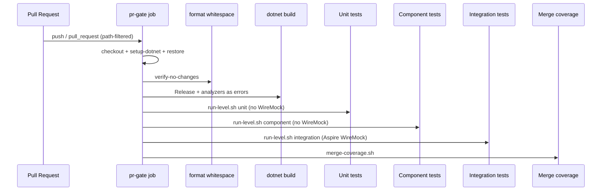

# AGENTS.md — CI / PR Gate

## TL;DR

The PR gate is a single-job workflow that restores, checks whitespace, builds with .NET analyzers as errors, then runs **unit → component → integration** as three named steps (WireMock only on integration), merges coverage, and uploads per-level test-result artifacts plus the merged coverage report.

## Non-Negotiables

- Keep the PR gate as **one job** with **three distinguishable test steps**. Do not collapse levels back into one composite step. Do not fan format/build into parallel jobs here (WT-10-03/04 still extend this job).
- **Unit level never starts WireMock/Aspire.** Component stays container-free until a test opts into `AspireCollection`. Only `run-level.sh integration` may start the Aspire AppHost.
- Analyzer enablement lives in `Directory.Build.props`; enforced severities live in `.editorconfig`. Do not silence rules with blanket `NoWarn` or `#pragma warning disable` — narrow the rule in `.editorconfig` with a reason comment, or fix the code.
- The Format step is `dotnet format **whitespace**`, deliberately. Bare `dotnet format` also runs the style and analyzer passes, which would make analyzer violations fail on Format before Build ever runs and collapse two distinct signals into one step. Do not drop the `whitespace` subcommand.
- `AnalysisLevel` is pinned to a version (`10.0-recommended`), not `latest-recommended`. With `TreatWarningsAsErrors=true` a floating level lets an SDK bump break `main` with no repository change. Raising it is a deliberate edit.
- `TreatWarningsAsErrors=true` stays on. A green Build step means zero analyzer/style diagnostics at the enforced severities.
- Coverage Include uses starts-with wildcards on the four product-assembly name prefixes (Domain, Application, Infrastructure, Host); test/architecture projects must not dilute coverage.
- Path-filter edits for build-config files are scoped; do not delete the `paths:` blocks to make the gate always-run (that is Gap A of WT-10-04).
- Architecture boundary enforcement lives in `tests/SmoothAiStockAnalysis.Architecture.UnitTest` (unit level). Extend those tests for new mechanical layer rules; do not re-encode them only as prose.

## System Context

GitHub Actions owns the quality gate for every merge to `main`. After restore/format/build, three scripts under `.github/actions/test-with-coverage/` own test execution:

| Script | Role |
|---|---|
| `common.sh` | Shared project lists, coverage collector string, parallel runner, Aspire helpers |
| `run-level.sh <unit\|component\|integration>` | One level; local and CI entry point |
| `merge-coverage.sh` | reportgenerator over `artifacts/testresults/**` → `artifacts/coverage/` |
| `run.sh` | Compatibility wrapper that runs all three levels then merges (not used by the named CI steps) |

## Architecture Decisions

### LADR-019 — Direct ILogger calls over LoggerMessage delegates

**Status:** Accepted. Enabling the analyzer gate surfaced CA1848 on every `ILogger.Log*` call — twenty diagnostics across roughly ten Infrastructure sites (startup seed, retention, unit-of-work rollback), none of them hot paths. `dotnet_diagnostic.CA1848.severity = suggestion` keeps explicit call sites rather than source-generated `LoggerMessage` partials, whose declaration-plus-generated-implementation indirection is what NFR-092 disfavours. Backend logging conventions stay concerned with level selection, not mechanism; a genuinely hot path can adopt `LoggerMessage` deliberately without flipping the repository severity. See [LADR-019](../docs/hlds/mvp/ladrs/019-direct-ilogger-calls-over-loggermessage.md).

### LADR-020 — Per-level test execution and architecture gate

**Status:** Accepted. NFR-069/NFR-090 verification. Per-level scripts + three named CI steps; WireMock only on integration; NetArchTest L0 project; parallel-within-level; coverage Include narrowed to the four product-assembly name prefixes (Domain, Application, Infrastructure, Host). Rejected: xunit traits, slnf-only, three jobs, always-on WireMock. See [LADR-020](../docs/hlds/mvp/ladrs/020-per-level-test-execution-and-architecture-gate.md).

## Key Behaviors

- **Two distinct pre-test signals.** Whitespace drift fails Format; CA and IDE diagnostics fail Build. Local: `dotnet format whitespace smooth-ai-stockanalysis.slnx --verify-no-changes`.
- **Three distinguishable test signals.** Step names are `Unit tests`, `Component tests`, `Integration tests`. Within a level, all projects run (parallel) even if one fails; the level then fails. After Build succeeds, later levels still run when an earlier level failed (`always() && !cancelled()`), so one red level does not hide another.
- **Per-level artifacts.** `test-results-unit`, `test-results-component`, `test-results-integration`, plus merged `coverage-report`.
- **CA1711 is narrowed, not disabled.** `dotnet_code_quality.CA1711.allowed_suffixes = Collection` exists for xUnit's `[CollectionDefinition]` convention (`AspireCollection`).
- **Path-filter trap.** `pr-gate.yml` path filters include `Directory.Build.props`, `.editorconfig`, `.config/dotnet-tools.json`, and `*.slnx` on both `push` and `pull_request`. Docs-only PRs still skip the gate — intentional until WT-10-04.
- **Migrations.** `Persistence/Migrations/**` is `generated_code = true` in `.editorconfig` and migration classes carry `[ExcludeFromCodeCoverage]`.
- **Parallel-within-level.** Catalogue pattern (`run &` + `wait` + `record_failure`). Safe because `SqliteTestDatabase` allocates `Guid`-named files per process. `ubuntu-latest` is 2-core; wall-clock win may be modest.
- **Aspire cleanup.** Integration level traps EXIT/INT/TERM, SIGTERM→wait→SIGKILL, and `docker rm -f wiremock`. Every path that starts Aspire must still stop it.

## Quality Constraints

- Format, analyzer, and each test level must be runnable locally (NFR-069).
- No third-party analyzer packages unless a future NFR requires them — baseline is SDK analyzers only.
- Architecture tests are L0 only; they must pass with no network and no container runtime.

## Migration Plans

- WT-10-03 adds secret scanning to the gate.
- WT-10-04 may make the gate always-run (remove or broaden path filters) and closes story #10.

## Changelog

| Date | Change | Ref |
|:-----|:-------|:----|
| 2026-07-25 | Created: format + analyzer gates, CA1848/CA1711 decisions, path-filter trap, WT-10-02 hand-off | #82 / WT-10-01 |
| 2026-07-25 | Review fixes: Format narrowed to `whitespace`; CA1711 via `allowed_suffixes`; `AnalysisLevel` pinned; LADR-019 | #82 / WT-10-01 |
| 2026-07-25 | Per-level unit/component/integration steps, WireMock only on integration, NetArchTest architecture project, coverage Include narrowed, LADR-020 | #83 / WT-10-02 |
