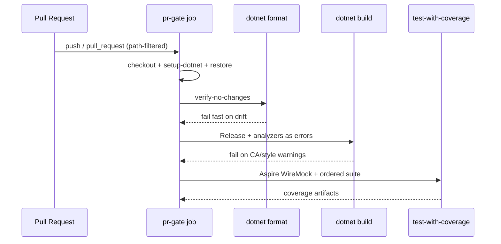

# AGENTS.md — CI / PR Gate

## TL;DR

The PR gate is a single-job workflow that restores, formats, builds with .NET analyzers as errors, and runs the ordered test suite; path filters currently skip docs-only PRs and must include build-config files or analyzer/format changes will not run.

## Non-Negotiables

- Keep the PR gate as **one job** until WT-10-02 restructures test execution — do not fan format/build/test into parallel jobs here.
- Analyzer enablement lives in `Directory.Build.props`; enforced severities live in `.editorconfig`. Do not silence rules with blanket `NoWarn` or `#pragma warning disable` — turn a rule off in `.editorconfig` with a reason comment, or fix the code.
- `TreatWarningsAsErrors=true` stays on. A green Build step means zero analyzer/style diagnostics at the enforced severities.
- Do not add NetArchTest or other architecture-boundary packages in this surface — that is WT-10-02 (NFR-090 hand-off).
- Path-filter edits for build-config files are scoped; do not delete the `paths:` blocks to make the gate always-run (that is Gap A of WT-10-04).

## System Context

GitHub Actions owns the quality gate for every merge to `main`. The workflow installs the .NET SDK, restores the solution, verifies formatting, builds Release with SDK analyzers, then runs the composite Aspire/WireMock test action and publishes coverage. Local agents must be able to reproduce the same format and build gates without GitHub (`dotnet format`, `dotnet build -c Release`).

## Architecture Decisions

### LADR-001: Keep direct ILogger calls (CA1848 not enforced)

- **Date**: 2026-07-25
- **Status**: Accepted
- **Context**: Enabling `latest-recommended` analyzers surfaces CA1848 on every `ILogger.Log*` extension call (~10 Infrastructure sites: startup seed, retention, unit-of-work rollback). The fix is source-generated `LoggerMessage` partial methods.
- **Decision**: Set `dotnet_diagnostic.CA1848.severity = suggestion` in `.editorconfig`. Keep explicit `logger.LogInformation` / `LogDebug` / `LogError` call sites.
- **Rejected alternative**: Adopt `LoggerMessage` delegates across affected call sites. That is the documented .NET performance guidance, but it introduces partial-method indirection and generated ceremony for low-volume startup/retention logs — the opposite of NFR-092 (explicit, low-indirection code preferred for AI-authored maintenance).
- **Consequences**: Logging stays readable at the call site. Backend logging conventions remain level-focused and do not require `LoggerMessage`. High-volume hot-path logging can still opt into `LoggerMessage` later without flipping the repo-wide severity.

### LADR-002: Preserve xUnit `*Collection` fixture names (CA1711 off)

- **Date**: 2026-07-25
- **Status**: Accepted
- **Context**: CA1711 flags `AspireCollection` because the type name ends in `Collection`. xUnit's `[CollectionDefinition]` pattern conventionally uses that suffix so tests can join the collection by name.
- **Decision**: `dotnet_diagnostic.CA1711.severity = none` with an explicit comment. Keep `AspireCollection`.
- **Rejected alternative**: Rename to something like `AspireFixtureCollectionDefinition` and update every `[Collection]` reference. That fights framework convention for no product benefit.
- **Consequences**: Collection fixture types may keep the `Collection` suffix. Do not treat CA1711 as a general license for domain type suffixes — it is off because of the test framework collision.

## Key Behaviors

- **Format before Build.** A formatting failure must surface on the Format step, not as a later compile noise. Local equivalent: `dotnet format smooth-ai-stockanalysis.slnx --verify-no-changes` (restore first if needed).
- **Path-filter trap.** `pr-gate.yml` path filters inherited from `builder-catalogue` originally omitted `Directory.Build.props`, `.editorconfig`, `.config/dotnet-tools.json`, and `*.slnx`. Changing those files alone would skip the gate. Those four paths are now included on both `push` and `pull_request`. Docs-only PRs still skip the gate — intentional until WT-10-04.
- **Severity resolution order.** SDK default → `AnalysisLevel`/`AnalysisMode` → `.editorconfig`. Reviewable policy belongs in `.editorconfig`, not hidden SDK defaults.
- **Migrations.** `Persistence/Migrations/**` is `generated_code = true` in `.editorconfig` and migration classes carry `[ExcludeFromCodeCoverage]`; analyzers skip them.
- **Hand-off to WT-10-02.** NFR-090 "layer dependency rules checked in the build" is an L0 architecture test project, not part of this workflow surface.

## Quality Constraints

- Format and analyzer gates must be runnable locally (NFR-069).
- No third-party analyzer packages (StyleCop, Sonar, Roslynator) unless a future NFR requires them — baseline is SDK analyzers only.
- Behaviour-preserving warning fixes only; analyzer cleanup must not weaken or delete tests.

## Migration Plans

- WT-10-02 will split test levels inside the same job family and add architecture boundary tests — extend this document rather than creating a second CI context.
- WT-10-03 adds secret scanning to the gate.
- WT-10-04 may make the gate always-run (remove or broaden path filters) and closes story #10.

## Changelog

| Date | Change | Ref |
|:-----|:-------|:----|
| 2026-07-25 | Created: format + analyzer gates, CA1848/CA1711 decisions, path-filter trap, WT-10-02 hand-off | #82 / WT-10-01 |
