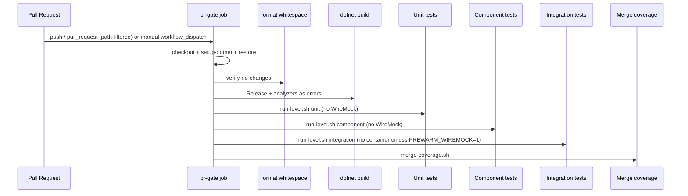

# AGENTS.md — CI / PR Gate

## TL;DR

The PR gate is a single-job workflow that restores, checks whitespace, builds with .NET analyzers as errors, runs a **secret scan** (gitleaks, PR commit range) that fails on a detected credential, then runs **unit → component → integration** as three named steps (no level needs a container runtime today), merges coverage, and uploads per-level test-result artifacts, the merged coverage report, and the `secret-scan-report` artifact.

## Non-Negotiables

- Keep the PR gate as **one job** with **three distinguishable test steps**. Do not collapse levels back into one composite step. Do not fan format/build into parallel jobs here (WT-10-03/04 still extend this job).
- **No level starts WireMock/Aspire by default.** `run-level.sh integration` pre-warms it only when `PREWARM_WIREMOCK=1`, and CI leaves that unset while no test opts into `AspireCollection`. Pre-warming is a latency optimisation, never a requirement — `AspireFixture` probes the well-known endpoint and starts its own AppHost when nothing answers. Do not make it unconditional: that provisions a container for zero consumers and breaks NFR-074 for every level that gains one.
- Analyzer enablement lives in `Directory.Build.props`; enforced severities live in `.editorconfig`. Do not silence rules with blanket `NoWarn` or `#pragma warning disable` — narrow the rule in `.editorconfig` with a reason comment, or fix the code.
- The Format step is `dotnet format **whitespace**`, deliberately. Bare `dotnet format` also runs the style and analyzer passes, which would make analyzer violations fail on Format before Build ever runs and collapse two distinct signals into one step. Do not drop the `whitespace` subcommand.
- `AnalysisLevel` is pinned to a version (`10.0-recommended`), not `latest-recommended`. With `TreatWarningsAsErrors=true` a floating level lets an SDK bump break `main` with no repository change. Raising it is a deliberate edit.
- `TreatWarningsAsErrors=true` stays on. A green Build step means zero analyzer/style diagnostics at the enforced severities.
- Coverage Include uses coverlet collector `[AssemblyName]Suffix` syntax on the four product-assembly name prefixes (e.g. `[SmoothAiStockAnalysis.Domain]*`); the syntax is passed to `dotnet test --collect:` and ReportGenerator consumes the resulting cobertura output. Test/architecture projects must not dilute coverage.
- Path-filter edits for build-config files are scoped; do not delete the `paths:` blocks to make the gate always-run (that is Gap A of WT-10-04).
- Architecture boundary enforcement lives in `tests/SmoothAiStockAnalysis.Architecture.UnitTest` (unit level). Extend those tests for new mechanical layer rules; do not re-encode them only as prose.

## System Context

GitHub Actions owns the quality gate for every merge to `main`. After restore/format/build, three scripts under `.github/actions/test-with-coverage/` own test execution:

| Script | Role |
|---|---|
| `common.sh` | Shared project lists, coverage collector string, parallel runner, Aspire helpers |
| `run-level.sh <unit\|component\|integration>` | One level; local and CI entry point |
| `merge-coverage.sh` | reportgenerator over `artifacts/testresults/**` → `artifacts/coverage/` |
| `run.sh` | Compatibility wrapper that runs all three levels then merges (not used by the named CI steps) |

## Architecture Decisions

### LADR-019 — Direct ILogger calls over LoggerMessage delegates

**Status:** Accepted. Enabling the analyzer gate surfaced CA1848 on every `ILogger.Log*` call — twenty diagnostics across roughly ten Infrastructure sites (startup seed, retention, unit-of-work rollback), none of them hot paths. `dotnet_diagnostic.CA1848.severity = suggestion` keeps explicit call sites rather than source-generated `LoggerMessage` partials, whose declaration-plus-generated-implementation indirection is what NFR-092 disfavours. Backend logging conventions stay concerned with level selection, not mechanism; a genuinely hot path can adopt `LoggerMessage` deliberately without flipping the repository severity. See [LADR-019](../docs/hlds/mvp/ladrs/019-direct-ilogger-calls-over-loggermessage.md).

### LADR-020 — Per-level test execution and architecture gate

**Status:** Accepted. NFR-069/NFR-090 verification. Per-level scripts + three named CI steps; WireMock pre-warm opt-in via `PREWARM_WIREMOCK` so no level needs a container runtime; NetArchTest L0 project; parallel-within-level (~2.6× on unit); coverage Include narrowed to the four product-assembly name prefixes (Domain, Application, Infrastructure, Host). Rejected: xunit traits, slnf-only, three jobs, always-on WireMock, unconditional integration pre-warm. See [LADR-020](../docs/hlds/mvp/ladrs/020-per-level-test-execution-and-architecture-gate.md).

## Key Behaviors

- **Two distinct pre-test signals.** Whitespace drift fails Format; CA and IDE diagnostics fail Build. Local: `dotnet format whitespace smooth-ai-stockanalysis.slnx --verify-no-changes`.
- **Three distinguishable test signals.** Step names are `Unit tests`, `Component tests`, `Integration tests`. Within a level, all projects run (parallel) even if one fails; the level then fails. After Build succeeds, later levels still run when an earlier level failed (`!cancelled() && steps.build.outcome == 'success'`), so one red level does not hide another.
- **Per-level artifacts.** `test-results-unit`, `test-results-component`, `test-results-integration`, plus merged `coverage-report`.
- **CA1711 is narrowed, not disabled.** `dotnet_code_quality.CA1711.allowed_suffixes = Collection` exists for xUnit's `[CollectionDefinition]` convention (`AspireCollection`). Do **not** replace this with `severity = none` — that trades a repository-wide guard for one test fixture name. The rule stays at `warning`, so `Queue` / `Stack` / `Ex` / `Impl` suffixes are still rejected across `src/`.
- **Path-filter trap.** `pr-gate.yml` path filters include `Directory.Build.props`, `.editorconfig`, `.config/dotnet-tools.json`, and `*.slnx` on both `push` and `pull_request`. Docs-only PRs still skip the gate — intentional until WT-10-04.
- **Migrations.** `Persistence/Migrations/**` is `generated_code = true` in `.editorconfig` and migration classes carry `[ExcludeFromCodeCoverage]`.
- **Parallel-within-level.** Catalogue pattern (`run &` + `wait` + `record_failure`). Safe because `SqliteTestDatabase` allocates `Guid`-named files per process. Measured on the unit level: 9.3 s sequential → 3.5 s parallel (~2.6×).
- **Aspire cleanup.** When pre-warming is enabled the integration level traps EXIT/INT/TERM, SIGTERM→wait→SIGKILL, then sweeps leftovers with `docker ps -aq --filter name=^wiremock`. Match by **prefix**: Aspire names the resource `wiremock-<suffix>`, so the previous fixed `docker rm -f wiremock` never matched anything and the safety net was a silent no-op. Every path that starts Aspire must still stop it — including `AspireFixture`, which disposes the AppHost it created.
- **`action.yml` has no caller.** `pr-gate.yml` invokes the scripts directly; the composite is retained only because a public repository's composite actions can be consumed cross-repo. It is not exercised by this repository's CI, so treat changes to it as untested and prefer editing the scripts it wraps.

## Secret scanning

NFR-043 verification clause: *"Repository scanned for committed credentials as part of the build."* The gate satisfies it with a named **Secret scan** step (implemented by `.github/actions/secret-scan/scan.sh`, configured by `.gitleaks.toml`) placed after Build and before the test levels, so a credential fails fast before the test levels spend their time. The step is optional only in the sense that it honours the same Build gate as the test levels (`steps.build.outcome == 'success'`); once Build succeeds it is mandatory.

### Tool and pinning

- **gitleaks 8.27.2**, installed by pinned SHA-256 (`GITLEAKS_SHA256`). The binary is fetched from the upstream release and checksum-verified; an upstream tamper or proxy swap fails the step rather than running a dodgy scanner.
- **Ruleset resolution gotcha (important).** The moment gitleaks is given a config file (via `--config` or auto-discovered `.gitleaks.toml`) the binary's built-in default ruleset is **replaced, not extended**. `useSystem = true` only loads a system-installed config (e.g. `/etc/gitleaks/`), which the CI runner does not have — so it silently yields an **empty ruleset** and nothing is ever flagged. To keep the full upstream ruleset while adding only this repo's allowlist, `scan.sh` also fetches the upstream default `gitleaks.toml` at the SAME pinned tag, checksum-verifies it (`GITLEAKS_CONFIG_SHA256`), and the committed `.gitleaks.toml` extends it by path. The runtime copy of `.gitleaks.toml` has its `[extend] path` rewritten to the absolute fetched location so the committed file stays portable.
- The step **consumes no secrets**, so `pull_request` runs from forks are scanned identically to same-repo PRs. GitHub's native push protection / secret scanning is **complementary, not a substitute** for this build clause.

### Scan scope and known blind spots

- The scan runs against the **PR commit range**, not the full repository history: `--log-opts` resolves to `base..head` SHAs for `pull_request`, `before..after` for `push`, and empty (full history) for `workflow_dispatch`. `actions/checkout` uses `fetch-depth: 0` so gitleaks can resolve the range via `git log`.
- **Blind spot A — pre-PR history.** A key committed to `main` before a PR's merge base is not re-scanned on every PR. Closing it would mean scanning the full history every run; that is too slow for the gate. History is instead covered by a one-off full scan (see PR body for the WT-10-03 verification scan) and by GitHub's native secret scanning, which scans `main` continuously.
- **Blind spot B — path filter.** `pr-gate.yml`'s `paths:` blocks mean the gate does not run for every file change. A credential committed to a path outside the filter (`docs/**`, `.agents/**`, `.context/**`) would **not** be scanned. Broadening the filters or moving the scan to a separate always-on workflow is WT-10-04's responsibility (see Migration Plans). Do not broaden the filter here without measuring the gate-runtime impact across every image.
- **Blind spot C — allowlist suppression.** `.gitleaks.toml` is the reviewable suppression surface. Every allowlist entry carries a comment saying why it is safe; an unexplained entry is how a real key gets ignored. **A real credential in a path-matched file is suppressed wholesale** — the global `[allowlist]` defaults to `condition = "OR"`, so a path match alone drops the finding regardless of whether the matched secret has any relationship to a known-safe shape. Verified empirically: a syntactically valid synthetic OpenAI key written into `src/SmoothAiStockAnalysis.Host/appsettings.json` is silently allowed by the gate scan with the current allowlist, and is flagged only when the upstream default ruleset is used alone. The load-bearing defense for `appsettings.json` is the L0 `CommittedConfigurationGuardTests` (which scans committed `appsettings.json` for secret-shaped literals on every `dotnet test`); the gate scan alone does NOT catch a real key there. The other path-allowed files (`HOST_AGENTS.md`, `CONFIGURATION_AGENTS.md`, `CredentialsOptions.cs`, `HostWebAppFixture.cs`, the L0 credentials/catalogue unit tests) are trusted by the gate scan and have **no second line of defense** — they must be reviewed for accidental key commits at PR review time. If a real key lands in any of these, treat the allowlist entry as the failure surface: rotate first, then suppress only the known-safe shape (not the whole file) if suppression is still warranted.

### Allowlist policy

- Add an entry ONLY for committed placeholders, documented detection-pattern catalogues, or deliberately non-secret test-fixture values. Each entry MUST have a comment naming the NFR, fixture, or reason. If a scanner finding might be a real secret, **escalate before allowlisting** — rotation precedes everything else.
- The current allowlist uses file-scoped (blanket) path suppressions for files documented as NFR-044-verified (committed placeholders, detection-pattern catalogues, deliberately non-secret test fixtures). File-scoped suppression is safe ONLY because the load-bearing defense for `appsettings.json` is the L0 `CommittedConfigurationGuardTests`; the other path-allowed files have no second line of defense and rely on PR review. **Future additions MUST be either shape-scoped (a `regex` matching the exact non-secret value, not the whole file) or accompanied by an L0 guard that asserts the file is key-free on every `dotnet test`.** See Blind spot C for the operational consequence and the empirical verification that a path match alone drops a finding.
- The L0 `CommittedConfigurationGuardTests` are a defense-in-depth complement: they scan committed `appsettings.json` for secret-shaped literals and the placeholder contract on every `dotnet test`. The gate scan adds history coverage (a key committed and removed within a PR) and repo-wide coverage (source the L0 guard does not assert against).

## AI review credential and variable inventory

Authoritative inventory for the AI review pipelines (root `AGENTS.md` repeats the names; the failure details live here so they do not drift from the workflow files). `secrets: inherit` in `pipeline-code-review-report.yml` resolves against the CALLER repo **and** its organization, so a secret provisioned at the org level satisfies the caller even though it is invisible to `gh secret list` at the repo level. Direct verification with the token available in this environment returns HTTP 403 for both `gh secret list` and `gh variable list` ("Resource not accessible by integration"); provisioning is therefore verified **indirectly** (see Provisioning status below).

### Provisioning status (measured 2026-07-25)

- Direct `gh secret list` / `gh variable list` → **HTTP 403** ("Resource not accessible by integration"). The token cannot enumerate secrets, so direct verification is not available. This is expected; it is NOT evidence that secrets are missing.
- Indirect evidence the required configuration is provisioned and operational: the most recent `PR Code Review Report` runs (ids 30157760529, 30157611535 — 2026-07-25 12:18, 12:13 UTC) and `PR AI Analyse (Self-Fix)` runs (30157903065, 30157658241 — 12:23, 12:15 UTC) all concluded `success`. A missing `OPENCODE_OPENAI_API_KEY` or any required variable would have failed them before the review was generated. The review report generator was observed resolving the `OPENAI` provider against `OPENCODE_OPENAI_API_KEY` in the run logs (run 30157760529) without a missing-credential error, and a review was posted to PR #269 (APPROVED at 12:23 UTC).
- **Conclusion:** the required secret and variables are provisioned and operational. The optional provider keys and the optional push token are not exercised by the current (OpenAI) configuration, so their provisioning state is unknown and is listed in the owner actions below.

### Secrets

| Name | Required? | Consumer workflow | Scope | Missing-credential failure |
|---|---|---|---|---|
| `OPENCODE_OPENAI_API_KEY` | **Required** | `pipeline-code-review-report.yml` (via `secrets: inherit`) | repo or org | Review report job fails early at provider resolution: the OpenAI provider is selected but the key is empty/missing; no review is posted and the run concludes `failure`. Observed: when present, the run proceeds and posts a review. |
| `OPENCODE_GEMINI_API_KEY` | Optional | `pipeline-code-review-report.yml` | repo or org | Only read when `OPENCODE_REVIEW_REPORT_PROVIDER=GEMINI` (not the current default). Missing it is silent under the OpenAI default; selecting GEMINI without it fails at provider resolution. |
| `OPENCODE_COPILOT_API_KEY` | Optional | `pipeline-code-review-report.yml` | repo or org | Only read when `OPENCODE_REVIEW_REPORT_PROVIDER=COPILOT`. Same failure shape as GEMINI above. |
| `OPENCODE_ANTHROPIC_API_KEY` | Optional | `pipeline-code-review-report.yml` | repo or org | Only read when `OPENCODE_REVIEW_REPORT_PROVIDER=ANTHROPIC`. Same failure shape as GEMINI above. |
| `OPENCODE_OPENROUTER_API_KEY` | Optional | `pipeline-code-review-report.yml` | repo or org | Only read when `OPENCODE_REVIEW_REPORT_PROVIDER=OPEN_ROUTER`. Same failure shape as GEMINI above. |
| `OPENCODE_ANALYSE_GH_TOKEN` | Optional | `pipeline-ai-analyse.yml` | repo or org | PAT with `workflow` scope, used to push self-fixes. Only needed when an autonomous fix touches `.github/workflows/**`. When missing AND a fix needs to commit a workflow change, the push step fails with a `403`/permission error and that fix cycle is recorded as failed (the run itself can still conclude success if no workflow-path fix was attempted). Under the current OpenAI default, fixes stay out of `.github/workflows/**`, so this token is not exercised. |

### Variables

| Name | Required? | Consumer | Default / expected | Missing-credential failure |
|---|---|---|---|---|
| `OPENCODE_REVIEW_REPORT_PROVIDER` | **Required** | `pipeline-code-review-report.yml` | `OPENAI` | The provider case statement falls back to `GEMINI` when unset; review generation then fails at `OPENCODE_GEMINI_API_KEY` resolution unless that key is also provisioned. The repo sets `OPENAI` to match the provisioned key. |
| `OPENCODE_REVIEW_REPORT_OPENAI_URL` | **Required (non-empty)** | `pipeline-code-review-report.yml` | `https://api.openai.com/v1` | Empty/unset → the OpenAI gateway URL resolves to empty and the provider call fails before posting a review. |
| `OPENCODE_REVIEW_REPORT_MODEL_PRIMARY` | **Required** | `pipeline-code-review-report.yml` | (model id, e.g. `gpt-5.5`) | Empty → the review request is rejected by the provider; the run fails to post a review. |
| `OPENCODE_REVIEW_REPORT_MODEL_SECONDARY` | **Required** | `pipeline-code-review-report.yml` | (model id) | Empty → runs that delegate to the secondary model fail; primary-only runs are unaffected. |
| `OPENCODE_REVIEW_REPORT_MODEL_ORCHESTRATOR` | **Required** | `pipeline-code-review-report.yml` | (model id) | Empty → orchestrator steps fail; the review may still post a partial result but the run records the error. |
| `OPENCODE_REVIEW_REPORT_DISABLE_CLAUDE_CODE` | **Required** | `pipeline-code-review-report.yml` | `1` | When unset, Claude Code support defaults on and may conflict with the opencode directory layout; review generation can error on directory collisions. The repo pins `1` to keep the layout deterministic. |
| `OPENCODE_ANALYSE_MAX_INCREMENTAL` | Optional | `pipeline-ai-analyse.yml` | `3` | Unset → the guard falls back to `3` auto-fix cycles. No failure; just a tighter cap. |
| `SMOOTH_AI_REVIEW_TOOLS_REF` | Optional | both review workflows | (upstream ref) | Unset → the workflows fetch the upstream default (`main`). No failure; a looser supply-chain pin. See root `AGENTS.md` CI/CD for the supply-chain trade-off. |

### Owner action list (provisioning is a human action — the agent cannot create or rotate secrets)

- **None required** for the OpenAI default to keep working: the required secret and required variables are provisioned and operational (proven indirectly 2026-07-25).
- **Recommended** (not blocking this worktask): the owner may want to confirm at Settings → Secrets and variables → Actions that `OPENCODE_OPENAI_API_KEY` exists at repo or org level, and rotate it on a schedule. The token in this environment cannot list secrets (403), so the indirect evidence above is all the verification available here.
- **Required before switching providers**: to use a non-OpenAI provider, the corresponding `OPENCODE_<PROVIDER>_API_KEY` must be provisioned and `OPENCODE_REVIEW_REPORT_PROVIDER` updated to match; otherwise review generation fails at provider resolution.
- **Required before autonomous workflow-path fixes**: if `pipeline-ai-analyse.yml` should push changes under `.github/workflows/**`, a PAT with `workflow` scope must be provisioned as `OPENCODE_ANALYSE_GH_TOKEN`; without it those specific fix cycles fail the push.

## Quality Constraints

- Format, analyzer, and each test level must be runnable locally (NFR-069).
- No third-party analyzer packages unless a future NFR requires them — baseline is SDK analyzers only.
- Architecture tests are L0 only; they must pass with no network and no container runtime.

## Migration Plans

- WT-10-03 added secret scanning to the gate (gitleaks, PR commit range). The scan inherits the gate's path filter, so docs-only and `.agents`/`.context` paths are a blind spot until WT-10-04.
- WT-10-04 may make the gate always-run (remove or broaden path filters — closing Blind spot B above — possibly move the scan into a separate always-on workflow) and closes story #10.

## Changelog

| Date | Change | Ref |
|:-----|:-------|:----|
| 2026-07-25 | Created: format + analyzer gates, CA1848/CA1711 decisions, path-filter trap, WT-10-02 hand-off | #82 / WT-10-01 |
| 2026-07-25 | Review fixes: Format narrowed to `whitespace`; CA1711 via `allowed_suffixes`; `AnalysisLevel` pinned; LADR-019 | #82 / WT-10-01 |
| 2026-07-25 | Per-level unit/component/integration steps, WireMock only on integration, NetArchTest architecture project, coverage Include narrowed, LADR-020 | #83 / WT-10-02 |
| 2026-07-25 | Review fixes: WireMock pre-warm made opt-in (`PREWARM_WIREMOCK`) so every level runs container-free (NFR-074 reworded to match its Target); `!cancelled()` de-duplicated; parallel speed-up measured; `action.yml` orphan status recorded | #83 / WT-10-02 |
| 2026-07-25 | ai-review PR #269: Aspire double-start guard, per-step `timeout-minutes`, build-gate invariant comment, dead Domain allow-list entries trimmed | #83 / PR #269 |
| 2026-07-25 | Secret scan step (gitleaks 8.27.2, pinned by SHA, PR commit range) added after Build; `.gitleaks.toml` allowlist (every entry commented); `fetch-depth: 0`; `secret-scan-report` artifact; full AI review credential + variable inventory with scope and missing-credential failure symptoms; scoping note (`secrets: inherit` resolves org-level); Blind spots A/B/C documented; NFR-043 verification clause satisfied. Closes #85 | #85 / WT-10-03 |
