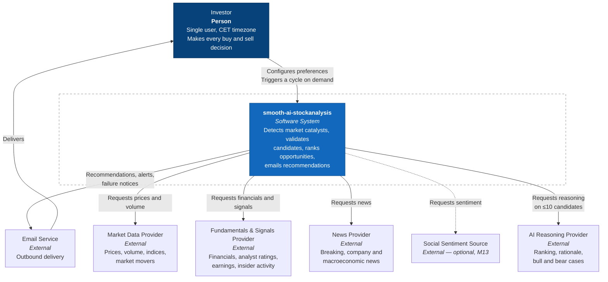
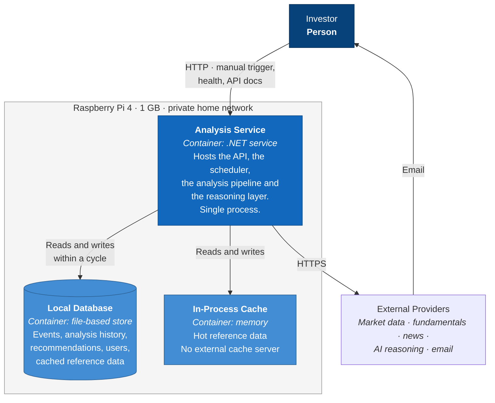
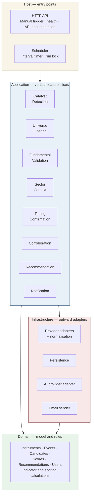
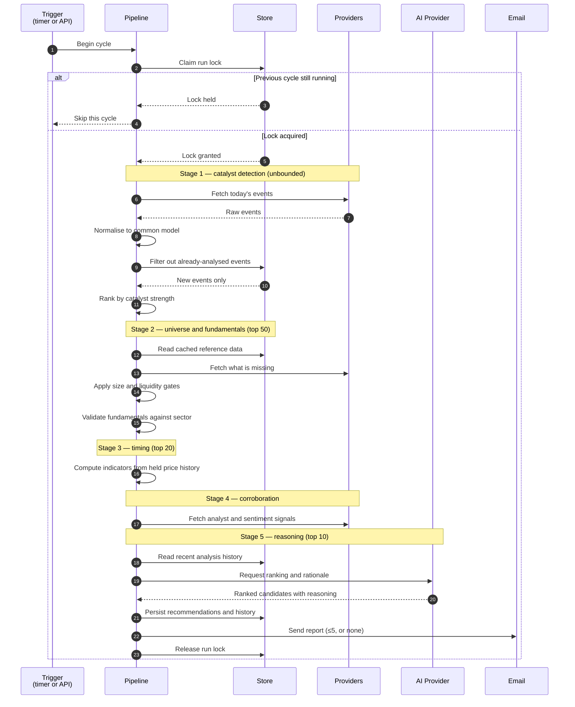
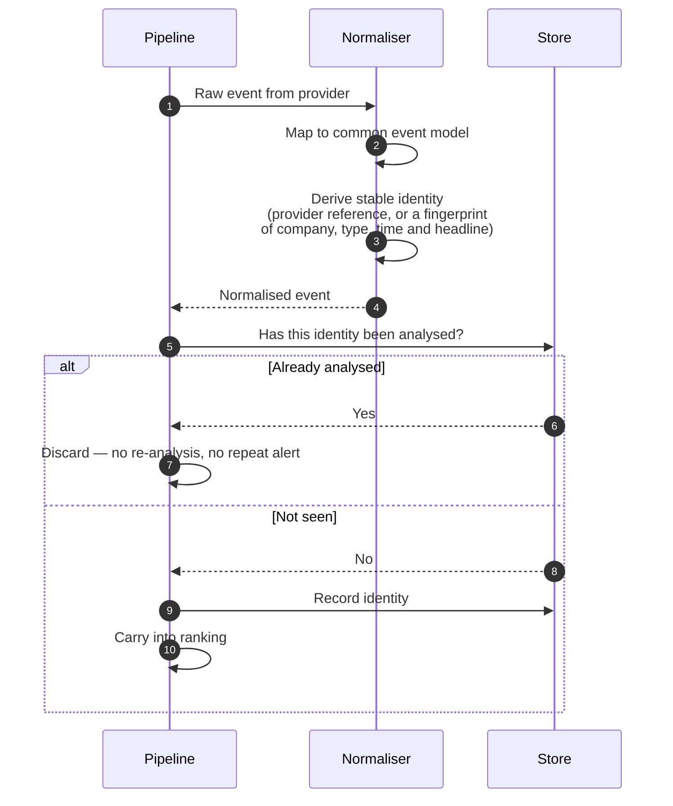
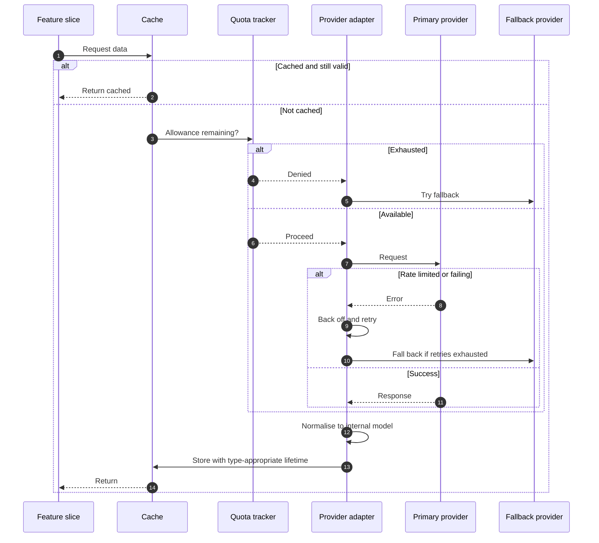
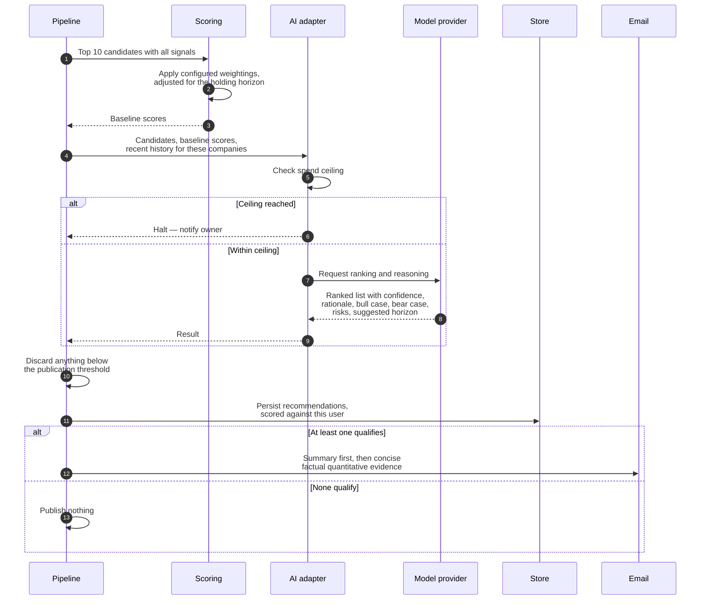
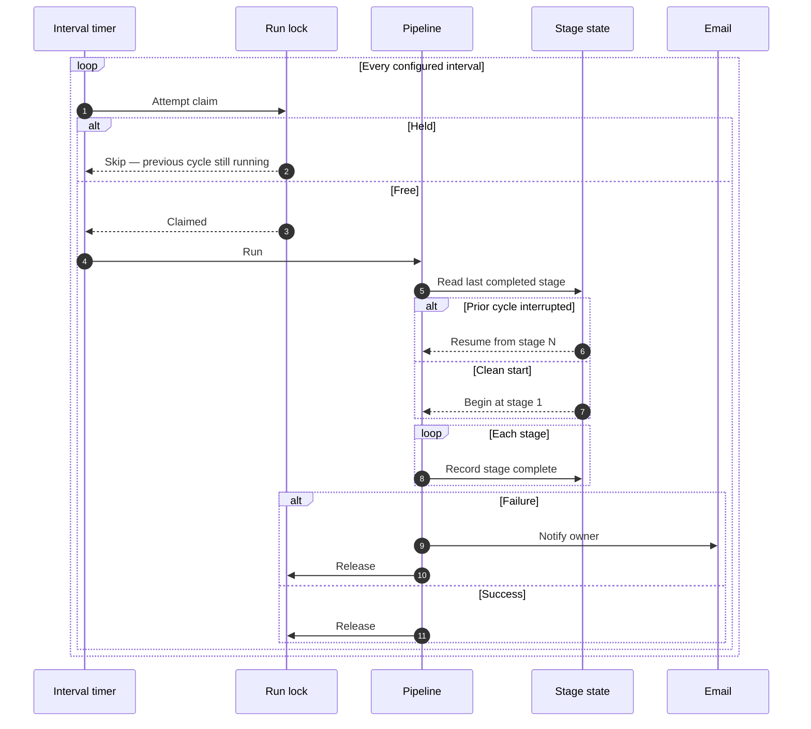

# High Level Design
## smooth-ai-stockanalysis

| | |
|---|---|
| **Document** | High Level Design (HLD) |
| **Product** | smooth-ai-stockanalysis |
| **Companion** | `docs/brd.md` — business requirements and milestones |
| **Status** | Draft for review |
| **Date** | July 2026 |
| **Intended location** | `docs/wiki/hld.md` |

> **Scope.** High level only. No code. Structure follows the BRD's milestones. Deeper design documents are produced per milestone, later — this document deliberately stops where those begin.

> **Diagram note.** C4 models are expressed as Mermaid flowcharts rather than Mermaid's experimental C4 syntax, which renders inconsistently on GitHub. The C4 semantics — person, system, container — are carried in the node labels.

---

## 1. TL;DR

**What it is.** One .NET service and one database file on a Raspberry Pi. Every 30 minutes it asks "what moved?", narrows the answer down through five progressively expensive filters, hands the last ten candidates to an AI for judgement, and emails at most five.

**The shape.** Clean architecture at the solution level, vertical feature slices inside the application layer. Each funnel stage is a discrete, idempotent, resumable step with its state written to the database — which is what delivers skip-if-running, crash recovery, and event de-duplication without an orchestration platform.

**The one number that governs everything.** Ten companies reach the AI per cycle. That cap makes cost predictable regardless of how busy the market is, and it is why free data tiers are viable at all.

### Implementation plan

| Milestone | Introduces | Architecturally new |
|---|---|---|
| **M1** Foundation | Solution skeleton, deployment, docs | Layer structure, persistence, user scoping, CI/CD |
| **M2** First recommendation | One provider, one catalyst, one email | Pipeline host, run lock, provider abstraction, email sender |
| **M3** Catalyst coverage | All catalyst types, dedup, history | Event identity, catalyst ranking, analysis history |
| **M4** Tradeability filters | Size and liquidity gates | Reference-data cache, currency conversion |
| **M5** Fundamental validation | Financial statements and ratios | Long-TTL fundamentals cache |
| **M6** Sector context | Sector aggregates, operating metrics | Shared sector projection |
| **M7** Timing confirmation | Indicators from owned price history | Internal computation, no new provider |
| **M8** Corroboration | Analyst, news sentiment, insider, calendar | Signal aggregation |
| **M9** Recommendation engine | Weighted scoring, AI reasoning | Agentic layer, spend ceiling |
| **M10** Reporting and alerting | Report format, alerts, failure notice | Notification composition |
| **M11** Cost and ROI evaluation | Quota measurement and analysis | Usage telemetry (no new components) |
| **M12** Continuous operation | Scheduled cycles, failover | Timer promotion, provider fallback |
| **M13** Social sentiment *(optional)* | Confidence adjustment only | One additional signal source |

Nothing before M9 needs the AI. Nothing before M12 needs a scheduler. Both are deliberate — the expensive and the unattended parts arrive only once the cheap and observable parts are proven.

---

## 2. Architectural principles

| # | Principle | Consequence |
|---|---|---|
| P1 | **Buy proprietary data, compute deterministic values.** | Indicators and composite scores are calculated internally. No indicator subscription. |
| P2 | **Narrow early, spend late.** | Broad cheap checks precede narrow expensive ones. Cost is bounded by stage caps, not by market activity. |
| P3 | **Every stage is resumable.** | Stage state is persisted. A crash resumes; it does not restart. |
| P4 | **Explicit over abstract.** | The codebase is optimised for AI collaboration: named, direct, close to the domain. Less indirection, not less discipline. |
| P5 | **Simplicity is a hardware constraint.** | One process, one database file, no container runtime, no message broker. 1 GB of RAM is the design authority. |
| P6 | **Multi-user shape, single-user reality.** | User identity exists from day one and is enforced at the data layer, though only one user exists. |
| P7 | **Reference data is shared; judgement is personal.** | Prices, financials and news are fetched once for everyone. Recommendations belong to a user. |

---

## 3. C1 — System context

**Boundary decisions**

- The investor is the only human actor. There is no administrator, no second role.
- No brokerage appears. The system never places a trade — this is a scope boundary, not an omission.
- Email is the sole delivery channel and, in Phase 1, strictly outbound. Phase 2 makes it bidirectional.
- Social sentiment is dashed: optional, last, and removable without consequence.

---

## 4. C2 — Containers

**Why so few containers.** This is a deliberate outcome of P5, not an unfinished diagram. On 1 GB of RAM, every additional process competes with the runtime for memory. A message broker, a distributed cache, a separate scheduler daemon and an orchestration server were each considered and each rejected. The system is one service and one file, and the design goes to some lengths to keep it that way.

**Two containers that were declined**

| Declined | Why |
|---|---|
| Distributed cache server | The caching pattern runs memory-only. A second-level cache serves multi-instance deployments; there is one instance. |
| Workflow orchestration server | Managed hosting exceeds the entire data budget; self-hosting requires its own database cluster. See [LADR-003](ladrs/003-defer-managed-workflow-orchestration.md). |

---

## 5. Internal structure

Clean architecture at the solution level; vertical feature slices inside the application layer.

**Why both patterns together.** Clean architecture governs dependency direction — the domain knows nothing of providers, storage or email. Vertical slices govern organisation within the application layer, so a feature's request, handler, validation and response sit together rather than being scattered across technical folders. The combination is deliberate: it keeps the blast radius of any one feature small, which matters when much of the code is written by AI agents working one slice at a time.

**Where the funnel lives.** Each application slice corresponds to one stage of the BRD funnel. Adding a stage means adding a slice. The milestone plan in §1 is therefore also, almost exactly, the order in which slices appear.

---

## 6. Key sequences

### 6.1 A complete analysis cycle

**Reading this diagram.** The stage caps are the load-bearing element. Provider calls before the caps are broad but cheap; the single AI call happens once, against at most ten candidates, after four rounds of elimination. Everything expensive is downstream of everything selective.

### 6.2 Event de-duplication

This is the mechanism behind two separate business requirements at once: never analyse the same event twice, and never send a repeat alert. It also collapses the same event reported by two different providers into one.

### 6.3 Provider access

**Cache lifetimes carry real commercial weight.** Company financials change quarterly; on a 30-minute cycle, caching them for weeks eliminates the overwhelming majority of fundamentals requests. This single behaviour is the difference between free allowances being adequate and being exhausted before lunch.

### 6.4 Reasoning and delivery

**Note on the two scores.** Weightings are applied deterministically first, then the AI may depart from them. The baseline is computed and retained even when the AI overrides it, because the evidence in the report needs to convey the weighting actually used — otherwise the explanation cannot account for the ranking. This is the mitigation for the reproducibility gap recorded in the BRD.

### 6.5 Scheduling and recovery

**This diagram is the argument against an orchestration platform.** Skip-if-running, resume-after-crash and per-stage progress are the three properties that would justify one. All three come from a run lock and persisted stage state — infrastructure already required for de-duplication and analysis history. See [LADR-003](ladrs/003-defer-managed-workflow-orchestration.md).

---

## 7. Cross-cutting design

### 7.1 Data ownership

| Category | Scope | Examples |
|---|---|---|
| **Reference data** | Shared across all users | Prices, volume, financials, news, sector aggregates, computed indicators |
| **User data** | Owned by one user | Watchlists, analysis history, recommendations, alerts, preferences, scoring configuration |

User-owned data is filtered at the data-access layer rather than in individual features, so isolation is a property of the system rather than of each developer's diligence.

**The subtlety.** Ingestion runs on behalf of nobody. Because the pipeline executes in the background, there is no ambient user to infer — so the pipeline sets user scope explicitly when producing user-owned results, and runs under an explicit system scope during ingestion. This is the part that leaks if it is not designed deliberately, so it is designed deliberately, at M1.

### 7.2 Configuration

Two layers, resolved in order: a **user preference** if set, otherwise an **application default**.

Everything tunable follows this: company size floor, liquidity thresholds, currency conversions, scoring weightings, holding horizon, stage caps, delivery window, cycle interval.

User preferences are held as a structured document with an explicit version marker, so the shape can evolve without migrating every user. Application defaults ship with the deployment and can be changed without a rebuild.

This is one pattern, not twelve settings — and it makes the Phase 3 dashboard a straightforward editor rather than a new subsystem.

### 7.3 Time

All instants stored in UTC. All business rules — the delivery window, trading sessions, cycle boundaries — expressed against a named timezone with local times, never a fixed offset, so that daylight-saving transitions do not silently shift behaviour by an hour twice a year.

### 7.4 Secrets and configuration

Provider endpoints, identifiers and all tunable values live in deployment configuration. Credentials live in environment variables and never in the repository, which is public. Configuration files carry placeholders so the shape is documented without the values.

### 7.5 Observability

Structured logging and tracing throughout, with the operational contract being deliberately modest: the owner is notified by email when a cycle fails. There is no dashboard, no alerting platform, no availability target. Quota consumption is recorded per provider — not for operational monitoring, but because it is the evidence base for the cost decision at M11.

### 7.6 Testing

Three levels: isolated unit tests of domain calculations, component tests of a feature slice with its dependencies substituted, and integration tests across the real persistence layer.

Domain calculations — indicators, scoring, liquidity measures, currency conversion — are pure and deterministic, and carry the heaviest test weight. Provider adapters are tested against recorded responses rather than live services, so the suite neither consumes allowances nor fails when a market is closed.

---

## 8. Lightweight architecture decision records

Recorded in full under [`ladrs/`](ladrs/README.md). Summarised here.

| # | Decision | Status |
|---|---|---|
| [LADR-001](ladrs/001-clean-architecture-with-vertical-slices.md) | Clean architecture at solution level, vertical feature slices in the application layer | Accepted |
| [LADR-002](ladrs/002-on-disk-sqlite-over-in-memory-snapshots.md) | File-based local database on disk, not held in memory with periodic snapshots | Accepted |
| [LADR-003](ladrs/003-defer-managed-workflow-orchestration.md) | No managed workflow orchestration; scheduling and durability built on the existing store | Accepted |
| [LADR-004](ladrs/004-compute-technical-indicators-internally.md) | Technical indicators computed internally rather than purchased | Accepted |
| [LADR-005](ladrs/005-event-driven-funnel-over-valuation-screening.md) | Event-driven funnel rather than valuation-led screening | Accepted |
| [LADR-006](ladrs/006-one-time-fork-of-template.md) | Template adopted as a one-time fork with no upstream tracking | Accepted |
| [LADR-007](ladrs/007-visible-docs-folder.md) | Documentation folder made visible rather than hidden | Accepted |
| [LADR-008](ladrs/008-direct-agent-rules-over-path-scoped.md) | Agent rules kept direct rather than path-scoped | Accepted |
| [LADR-009](ladrs/009-email-as-sole-delivery-channel.md) | Email as sole delivery channel | Accepted |
| [LADR-010](ladrs/010-user-identity-from-first-release.md) | User identity and data isolation present from first release | Accepted |
| [LADR-011](ladrs/011-memory-only-caching.md) | Memory-only caching, no cache server | Accepted |
| [LADR-012](ladrs/012-liquidity-median-excluding-catalyst-day.md) | Liquidity measured as a median over prior sessions, excluding the catalyst day | Accepted |
| [LADR-013](ladrs/013-abstracted-ai-reasoning-provider.md) | Reasoning provider abstracted; both major providers supported | Accepted |

### The three that most shape the system

**[LADR-003](ladrs/003-defer-managed-workflow-orchestration.md) — No managed orchestration.**
*Context.* A durable workflow platform was a hoped-for requirement: it offers scheduled execution, retry of unreliable model calls, crash recovery and human-in-the-loop pauses — all directly relevant.
*Decision.* Deferred. Managed hosting begins at roughly $100 per month with no free tier, exceeding the entire data budget for infrastructure not yet needed; self-hosting requires operating a database cluster, which will not fit the target hardware. Durability is instead built on the run lock and persisted stage state already required for de-duplication.
*Consequences.* No human-in-the-loop capability — acceptable, since the human acts on an email rather than inside a workflow. Stages must be designed idempotent and resumable, which is good discipline regardless. Adoption later is a substitution rather than a rewrite. Revisit only if scale justifies the cost.

**[LADR-002](ladrs/002-on-disk-sqlite-over-in-memory-snapshots.md) — On-disk database, not in-memory with snapshots.**
*Context.* The target hardware boots from a memory card with finite write endurance. Holding the database in memory and snapshotting periodically was proposed to reduce wear.
*Decision.* Rejected. A periodic full snapshot rewrites the entire database each time; write-ahead journaling with one batched transaction per cycle writes only what changed, at a small fraction of the volume. The proposed remedy would have increased wear rather than reduced it. Separately, the operating system's own page cache already keeps frequently-read data in memory — delivering the intended read performance without consuming the runtime's memory budget on a 1 GB device.
*Consequences.* Read-latency targets are met without special measures. Moving to solid-state storage later is a configuration change. Retention pruning is required to keep the working set small.

**[LADR-012](ladrs/012-liquidity-median-excluding-catalyst-day.md) — Liquidity measured excluding the catalyst day.**
*Context.* Candidates enter the funnel because something happened to them. Whatever happened moved their trading volume.
*Decision.* Liquidity is assessed as a median across prior sessions, with the catalyst day excluded.
*Consequences.* Prevents the systematic error where thinly-traded companies appear liquid precisely when being evaluated, because the event that surfaced them also inflated their volume. This choice affects candidate quality more than the threshold value does.

---

## 9. Non-functional requirements

Maintained in full under `docs/hlds/mvp/nfr/`. Summarised here with the design response.

| Area | Requirement | Design response |
|---|---|---|
| **Response time** | Cached reads under 500 ms | Memory cache plus operating-system page cache; no network on the cached path |
| **Cost predictability** | Bounded spend per cycle | Stage caps; at most ten candidates reach reasoning regardless of market activity |
| **Resilience** | Retry, rate-limit handling, provider failover | Handled in provider adapters; features are unaware of which provider served them |
| **Data efficiency** | Reuse infrequently-changing data | Cache lifetimes matched to how often each data type genuinely changes |
| **Portability** | Provider-agnostic internals | All responses normalised to a common internal model at the adapter boundary |
| **Quota awareness** | Track consumption per provider | Recorded per call; evidence base for the M11 cost decision |
| **Durability** | Survive restart mid-cycle | Persisted stage state; resume rather than restart |
| **Concurrency** | Never overlap cycles | Run lock claimed at cycle start, released at completion or failure |
| **Isolation** | User data separated | Enforced at the data-access layer, not per feature |
| **Configurability** | User overrides application defaults | Single two-layer resolution pattern across all tunable values |
| **Time correctness** | No daylight-saving drift | UTC storage; named timezone with local times for all business rules |
| **Footprint** | Operate within 1 GB | One process, one file, no broker, no cache server, no container runtime |
| **Developer experience** | Runs locally for debugging | Same service, same store; no orchestration or container dependency |
| **Documentation** | Interactive API documentation | Generated from the API surface and served by the host |
| **Openness** | Public repository | No credentials in configuration; documentation written for an external reader |

### Remaining technical uncertainty

The remaining open uncertainty from §9 is identified for resolution during M1 rather than discovered later.

| Uncertainty | Concern |
|---|---|
| Date and time library support on the chosen store | **Resolved by LADR-014:** lossless custom NodaTime-to-SQLite converters are globally registered before any schema depends on them. |
| Structured-document columns on the chosen store | Support is thinner than on server databases. Whether the contents ever need to be queried — rather than merely read and written whole — determines the approach. |

---

## 10. Milestone design notes

Brief by intent. Each expands into its own design document when it is scheduled.

**M1 — Foundation.** Establishes layer boundaries, persistence, user identity and isolation, deployment to the target hardware, quality gates, and public documentation. Resolves the remaining technical uncertainty in §9. Nothing user-visible ships; everything downstream assumes it.

**M2 — First recommendation.** The narrowest possible vertical slice: one provider, one catalyst type, deterministic scoring, one email, triggered manually. Proves the host, the run lock, the provider abstraction, persistence and delivery work together before anything expensive is built on top.

**M3 — Catalyst coverage.** Introduces event identity and de-duplication, catalyst ranking, and one month of retained analysis history. This is where a demonstration becomes a system: the funnel's mouth opens fully, and the memory that prevents repetition begins.

**M4 — Tradeability filters.** Adds the universe gates and the currency conversion table. Purely deterministic, no new providers, no AI. The cheapest quality improvement in the plan.

**M5 — Fundamental validation.** Adds financial statement retrieval with long cache lifetimes. The point at which caching stops being an optimisation and starts being what makes free allowances workable.

**M6 — Sector context.** Introduces sector aggregates as shared, reusable reference data, computed once and read by every candidate in that sector. Serves both relative scale and sector-relative profitability measures — two requirements, one piece of shared work.

**M7 — Timing confirmation.** Adds indicator computation over price history already held. No provider, no cost, no new external dependency. The clearest expression of P1.

**M8 — Corroboration.** Adds analyst signals, news sentiment, insider activity and the forward calendar. Broadens inputs without changing the structure.

**M9 — Recommendation engine.** Adds the reasoning layer, the deterministic baseline scoring beneath it, the horizon-adjusted weightings, and the spend ceiling. The first milestone with a genuinely non-deterministic component, and therefore the first requiring judgement rather than assertion to accept.

**M10 — Reporting and alerting.** Adds report composition, publication thresholds, ad-hoc alerting and failure notification. Output quality becomes a design concern in its own right rather than a by-product.

**M11 — Cost and ROI evaluation.** No new components. Consumes the quota telemetry accumulated since M2 to produce an evidence-based subscription decision.

**M12 — Continuous operation.** Promotes the manual trigger to a scheduled one and activates provider fallback. Architecturally small — because everything it requires was built in earlier milestones for other reasons.

**M13 — Social sentiment.** One additional signal, adjusting confidence only. Optional and last, and removable without consequence.

---

## 11. Deferred and out of scope

| Item | Phase | Architectural note |
|---|---|---|
| Position tracking from emailed replies | 2 | Introduces the first **inbound** channel. Everything in Phase 1 is outbound; this is a different integration shape, not an extension of the sender. |
| Sell-side recommendations and loss collars | 2 | Requires held positions to exist first. Depends on the above. |
| Outcome measurement against the return target | 2 | The feedback loop Phase 1 structurally cannot have. |
| User dashboard | 3 | The two-layer configuration pattern is what makes this an editor rather than a subsystem. |
| Authentication and role-based access | 3 | User identity and isolation already exist from M1; this adds a front door, not a data model. |
| User-selected currency and daily rate refresh | Future, low priority | Conversion is already a single lookup — this replaces a static table with a refreshed one. |
| Managed workflow orchestration | Conditional | See [LADR-003](ladrs/003-defer-managed-workflow-orchestration.md). Substitution, not rewrite. |
| Path-scoped agent rules | Conditional | Revisit when Phase 3 introduces a second technology stack. |

---

## 12. Open items

| # | Item | Needed by |
|---|---|---|
| 1 | Currency conversion values for remaining Nordic and UK markets | M4 |
| 2 | Weighting distribution for the short holding horizon | M9 |
| 3 | Confirmation of the reasoning provider and transport | M9 |
| 4 | Continuous integration and agent rule content from the reference repository, not yet retrieved | M1 |
| 5 | Project board field configuration, not readable at time of writing | M1 |
