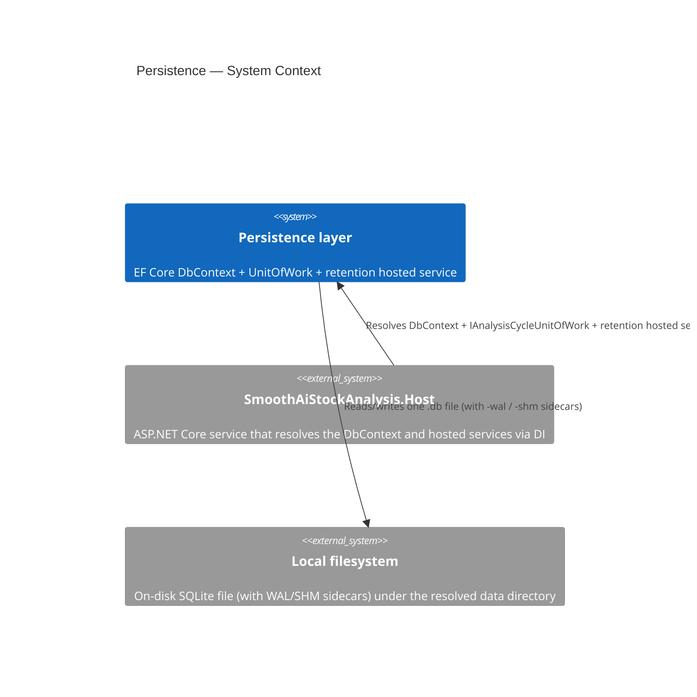

# PERSISTENCE_AGENTS.md

## TL;DR

Persistence is an Infrastructure-only, on-disk SQLite foundation that batches each future analysis cycle into one transaction.

## Non-Negotiables

- Keep the application database file-backed; do not use in-memory SQLite for the running service.
- A future analysis cycle must call `IAnalysisCycleUnitOfWork` once; repositories in that scope must not independently save or commit.
- Keep SQLite and EF Core types out of Domain and Application. NodaTime conversion is an Infrastructure concern and follows LADR-014; application/domain code never sees SQLite representations.

## System Context

Persistence is the Infrastructure-owned SQLite foundation the Host uses to durably record analysis-cycle output. `SmoothAiStockAnalysisDbContext` opens one on-disk database file per Host instance, applies WAL and `synchronous=NORMAL` through the connection interceptor, and commits one cycle's writes as a single transaction via `IAnalysisCycleUnitOfWork`. The retention hosted service runs the mandatory monthly seam; until timestamped analysis-history entities arrive, the seam is a no-op. There are no external service dependencies — the only boundary is the local filesystem.

## Architecture Decisions

### LADR-002 — On-disk SQLite over in-memory snapshots

**Status:** Accepted. **Context:** the target device has constrained memory and finite storage-write endurance. **Decision:** use one on-disk SQLite database with WAL, relaxed synchronous writes, one transaction per cycle, and mandatory retention. **Consequences:** the operating-system page cache serves hot reads; an in-memory database or independent per-stage commits would undermine the durability and write-volume constraints.

### LADR-014 — Lossless NodaTime mappings for SQLite

**Status:** Accepted. `SmoothAiStockAnalysisDbContext.ConfigureConventions` globally maps `Instant`, `LocalDate`, and `ZonedDateTime` through custom text converters. Instants are canonical lossless UTC ISO text; local dates retain calendar identity; and zoned values retain their instant, TZDB IANA zone ID, and calendar ID. See [LADR-014](../../../docs/hlds/mvp/ladrs/014-lossless-nodatime-mappings-for-sqlite.md).

### LADR-015 — Structured documents as JSON text via a value converter

**Status:** Accepted. Versioned structured documents (e.g. user metadata) persist as one canonical JSON `TEXT` column through `VersionedDocumentSqliteValueConverter<TDocument>` (`Converters/`), rather than EF Core's native `OwnsOne(...).ToJson()` mapping. `TDocument` implements the Domain's `IVersionedDocument` (explicit `int SchemaVersion`, NFR-048), keeping Domain independent from Infrastructure; the document should keep a `[JsonExtensionData]` member so unknown/forward-compatible fields survive a read-modify-write cycle. The converter is selected because metadata is an opaque one-column payload with an application-controlled serialization contract, not because native JSON mapping lacks these document capabilities. Apply `VersionedDocumentSqliteValueComparer<TDocument>` beside the converter whenever the document is mutable, so EF detects in-place changes. Unlike the LADR-014 mappings this pair is applied **per property**, not registered globally. Adding a field is a document-version change, not a schema migration. See [LADR-015](../../../docs/hlds/mvp/ladrs/015-json-document-columns-via-value-converter-on-sqlite.md).

## Key Behaviors

- `SqlitePragmaConnectionInterceptor` applies WAL and `synchronous=NORMAL` whenever a SQLite connection opens. WAL persists with the database; synchronous mode is connection-scoped, so verify it on an open EF connection.
- `SqliteDatabaseInitializer` creates the empty local database at Host startup with `EnsureCreatedAsync`. There is no migration until a feature introduces the first persisted entity.
- `AnalysisHistoryRetentionHostedService` runs the mandatory retention seam daily with a one-calendar-month policy. It is deliberately a no-op until timestamped analysis-history entities arrive in F-003/M3.
- The connection string in `appsettings.json` can be overridden at runtime by the environment variable `ConnectionStrings__SmoothAiStockAnalysis` (the standard ASP.NET Core double-underscore section separator), which the default environment-variable configuration provider applies after the JSON sources. Relative SQLite data sources are normalized against `AppContext.BaseDirectory`, never the process working directory.
- Future EF properties of the mapped NodaTime types inherit the global converters automatically. Do not store an offset/local string as the authoritative form of an instant.
- `VersionedDocumentSqliteValueConverter<TDocument>` serializes a document with `SqliteJsonSerialization.Default` (camelCase, compact) — that options instance **is** the stored contract, so changing it changes every persisted payload. The converter is stateless and safe to construct per model configuration; paired `VersionedDocumentSqliteValueComparer<TDocument>` provides deep comparison/snapshotting for mutable documents. Forward compatibility is the document's `[JsonExtensionData]` responsibility, not the converter's.

## Test References

- **L1:** `Infrastructure.ComponentTest/SqlitePersistenceTests.cs` verifies the real-file connection settings and the transaction commit/rollback boundary. `AppliesProductionPragmasToFreshConnectionWithoutEnsureCreated` proves the PRAGMA invariant is applied by `SqlitePragmaConnectionInterceptor` alone — on a scope that never calls `EnsureCreatedAsync` — so it stays green independently of whichever path creates the database.
- **L2:** `Host.IntegrationTest/SmokeTests.cs` starts the Host against an isolated SQLite file and verifies that the production connection interceptor still applies WAL and `synchronous=NORMAL`.
- **L1:** `Infrastructure.ComponentTest/NodaTimeSqlitePersistenceTests.cs` derives a test-only model from the production context and round-trips time values through its production converter convention against an isolated SQLite file.
- **L1:** `Infrastructure.ComponentTest/UserMetadataDocumentSqlitePersistenceTests.cs` proves the LADR-015 document mapping (T-015/#59): a test-only versioned document round-trips its version marker and representative preferences, retains an unknown forward-compatible field across a read-modify-write cycle, and stores as inspectable `text` — through `VersionedDocumentSqliteValueConverter<TDocument>` against an isolated SQLite file. The production user-metadata document arrives with worktask 02.

### L2 fixture override

`Program.cs` calls `AddInfrastructure()` without capturing configuration. The
extension resolves `IConfiguration` only when EF creates the DbContext options, after
the test fixture's `WithWebHostBuilder.ConfigureAppConfiguration` override is
composed. The generic fixture's isolated `DatabaseConnectionString` therefore reaches
the production registration without replacing `DbContextOptions` or reattaching the
interceptor. `SmokeTests.HostBootsAndRespondsToHttp` proves both the isolated file and
the production PRAGMAs.

## Quality Constraints

- NFR-034 requires one transaction per analysis cycle. See [NFR-034](../../../docs/hlds/mvp/nfr/006-durability-and-concurrency.md) for the single-transaction boundary.
- NFR-078 and NFR-079 require local operation and tests with no container runtime or external service. See [NFR-078](../../../docs/hlds/mvp/nfr/013-deployability.md) and [NFR-079](../../../docs/hlds/mvp/nfr/013-deployability.md).

## Package Notes

- `Microsoft.Data.Sqlite` is the only `Directory.Packages.props` entry referenced exclusively from `tests/SmoothAiStockAnalysis.TestFramework/`. The runtime still pulls it transitively through `Microsoft.EntityFrameworkCore.Sqlite`, but the test framework needs it directly to construct the `SqliteConnectionStringBuilder` used in `SqliteTestDatabase`. Bump and audit together.

## Migration Plans

When the first feature adds a persisted entity, introduce the initial migration under `Migrations/` and mark generated migration classes with `[ExcludeFromCodeCoverage]`. NodaTime properties require no per-entity conversion configuration: they use the LADR-014 global convention. The migration's columns are SQLite `TEXT`.

## Changelog

| Date | Change | Ref |
|:-----|:-------|:----|
| 2026-07-23 | Documented the SQLite durability, transaction, retention, test, and migration conventions. | #6 |
| 2026-07-23 | Restructured the context to the repository AGENTS quality standard. | #252 |
| 2026-07-23 | Documented the L2 SQLite connection-invariant coverage. | #252 |
| 2026-07-23 | Documented why the L2 `DbContextOptions` replacement is required and not redundant. | #252 |
| 2026-07-24 | Fixed Quality Constraints NFR links to `docs/hlds/mvp/nfr/`; documented the fresh-connection PRAGMA test that decouples the invariant from `EnsureCreatedAsync`. | #252 |
| 2026-07-24 | Deferred Host connection-string resolution to DbContext creation, allowing L2 configuration overrides without re-registering options; anchored relative SQLite paths to the app base directory. | #252 |
| 2026-07-24 | Added the missing mandatory System Context section (with C4Context diagram) between Non-Negotiables and Architecture Decisions, satisfying the repository AGENTS quality standard. | #252 |
| 2026-07-24 | Added the LADR-014 global, lossless NodaTime SQLite converter contract and its isolated-file L1 coverage. | #6 |
| 2026-07-24 | Decided the versioned-document representation (LADR-015): per-property `VersionedDocumentSqliteValueConverter` over native `.ToJson()`, with `IVersionedDocument` version marker and `[JsonExtensionData]` forward-compatibility; added the isolated-file L1 proof. | #59 |
| 2026-07-24 | Corrected the LADR-015 adapter boundary and tracking behavior: `IVersionedDocument` now belongs to Domain, and mutable JSON documents use a canonical deep comparer/snapshot. | #59 |
