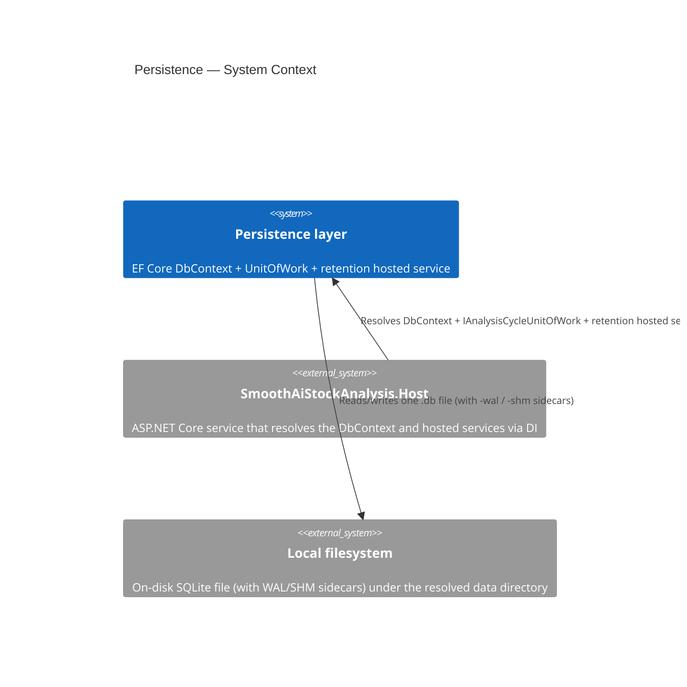

# PERSISTENCE_AGENTS.md

## TL;DR

Persistence is an Infrastructure-only, on-disk SQLite foundation that batches each future analysis cycle into one transaction.

## Non-Negotiables

- Keep the application database file-backed; do not use in-memory SQLite for the running service.
- A future analysis cycle must call `IAnalysisCycleUnitOfWork` once; repositories in that scope must not independently save or commit.
- Keep SQLite and EF Core types out of Domain and Application. NodaTime conversion is an Infrastructure concern and follows LADR-014; application/domain code never sees SQLite representations.

## System Context

Persistence is the Infrastructure-owned SQLite foundation the Host uses to durably record analysis-cycle output. `SmoothAiStockAnalysisDbContext` opens one on-disk database file per Host instance, applies WAL and `synchronous=NORMAL` through the connection interceptor, and commits one cycle's writes as a single transaction via `IAnalysisCycleUnitOfWork`. The retention hosted service runs the mandatory monthly seam; until timestamped analysis-history entities arrive, the seam is a no-op. There are no external service dependencies — the only boundary is the local filesystem.

## Architecture Decisions

### LADR-002 — On-disk SQLite over in-memory snapshots

**Status:** Accepted. **Context:** the target device has constrained memory and finite storage-write endurance. **Decision:** use one on-disk SQLite database with WAL, relaxed synchronous writes, one transaction per cycle, and mandatory retention. **Consequences:** the operating-system page cache serves hot reads; an in-memory database or independent per-stage commits would undermine the durability and write-volume constraints.

### LADR-014 — Lossless NodaTime mappings for SQLite

**Status:** Accepted. `SmoothAiStockAnalysisDbContext.ConfigureConventions` globally maps `Instant`, `LocalDate`, and `ZonedDateTime` through custom text converters. Instants are canonical lossless UTC ISO text; local dates retain calendar identity; and zoned values retain their instant, TZDB IANA zone ID, and calendar ID. See [LADR-014](../../../docs/hlds/mvp/ladrs/014-lossless-nodatime-mappings-for-sqlite.md).

### LADR-015 — Structured documents as JSON text via a value converter

**Status:** Accepted. Versioned structured documents (e.g. user metadata) persist as one canonical JSON `TEXT` column through `VersionedDocumentSqliteValueConverter<TDocument>` (`Converters/`), rather than EF Core's native `OwnsOne(...).ToJson()` mapping. `TDocument` implements the Domain's `IVersionedDocument` (explicit `int SchemaVersion`, NFR-048). For user metadata, an Infrastructure persistence document owns `[JsonExtensionData]` and the forward-compatible field bag while the Domain model remains serialization-free; explicit translation connects the two representations. The converter is selected because metadata is an opaque one-column payload with an application-controlled serialization contract, not because native JSON mapping lacks these document capabilities. Apply `VersionedDocumentSqliteValueComparer<TDocument>` beside the converter whenever the document is mutable, so EF detects in-place changes. Unlike the LADR-014 mappings this pair is applied **per property**, not registered globally. Adding a field is a document-version change, not a schema migration. See [LADR-015](../../../docs/hlds/mvp/ladrs/015-json-document-columns-via-value-converter-on-sqlite.md).

### LADR-016 — lower_snake_case relational naming via EFCore.NamingConventions

**Status:** Accepted. `UseSnakeCaseNamingConvention()` (`EFCore.NamingConventions` package) is applied at every production options seam — the Host DI registration and the design-time factory — so every entity yields `lower_snake_case` table, column, primary/foreign-key, and index names without per-entity naming configuration. Entity configuration classes carry only non-naming concerns (value generation, requiredness, column types, converters/comparers); repeating `ToTable`/`HasColumnName`/`HasName`/`HasDatabaseName` for convention-derived names is prohibited. A `DbSet` exposed through a set property is named after the set property, so name set properties for the intended table. The convention also rewrites EF's infrastructure names (`__EFMigrationsHistory` keeps its table name, but its columns are `migration_id`/`product_version`). The JSON payload inside document columns stays camelCase (LADR-015); only the relational names change. Derived test probe contexts opt in on their own options builder. See [LADR-016](../../../docs/hlds/mvp/ladrs/016-snake-case-relational-naming-via-efcore-namingconventions.md).

## Requirements

### Initial user schema

The first production feature schema contains only the tenant-root `user_record` table plus EF's migration history:

| Table | Classification | Ownership key | Required shape |
|---|---|---|---|
| `user_record` | Tenant root containing user identity and owned metadata | `id` itself | `id INTEGER` generated primary key, `unique_identifier TEXT NOT NULL` with a global unique index, and `metadata TEXT NOT NULL` |
| `__EFMigrationsHistory` | EF infrastructure metadata | None | Framework-managed; never user-filtered |

- The physical table is named `user_record` after the `UserRecord` persistence type, per the LADR-016 global snake_case naming convention. `InitialUserSchema` originally created it as `users`; `SnakeCaseNamingConvention` renamed it (`users` → `user_record`, `pk_users` → `pk_user_record`, `ux_users_unique_identifier` → `ix_user_record_unique_identifier`) before any production database existed. Canonical docs and code use `user_record` only.
- `user_record.id` is a compact internal `long` key for future foreign keys. `user_record.unique_identifier` is a stable externally exposable GUID; it is not a secret or access-control mechanism.
- The tenant root has no self-referencing `user_id`. Worktask 03 must filter this tenant root by `id`.
- The initial metadata payload carries `"schemaVersion":1` and no preference business fields. Infrastructure owns its serialization representation and preserves unknown members through extension data. Persisted metadata updates merge into the tracked document and reject schema-version regression.
- There are no production owned-dependent or shared-reference tables yet; do not create production placeholders to demonstrate either category. The extension path is the shared configuration helpers below, proven by a test-only probe entity.

### Ownership and uniqueness convention

- Every future user-owned dependent table has a required `user_id` FK to `user_record.id`.
- Configure that FK through `Configurations/UserOwnedEntityTypeBuilderExtensions.ConfigureUserOwnedDependent`, which also applies restrictive delete semantics until user-deletion policy is designed.
- Every natural unique index on a user-owned dependent starts with the ownership key: `(user_id, natural_key...)`. Create it only through `HasUserScopedUniqueIndex(...)`, which prepends `UserId` automatically and rejects an empty or ownership-only key list. A competing global unique index on the same natural key is prohibited.
- Shared market/reference tables have no `user_id`, are never user-filtered, and must not call the user-owned helpers. Shared examples include market data, company financials, news, computed indicators, and sector aggregates.
- Owned examples include watchlists, analysis history, recommendations, alerts, notification preferences, and scoring configuration.
- Infrastructure tables such as `__EFMigrationsHistory` carry no ownership key.

### Migration-based initialization

- Every generated migration lives under `Persistence/Migrations/` and its migration class is marked `[ExcludeFromCodeCoverage]`.
- The design-time context factory keeps migration generation independent from Host startup, hosted services, deployment configuration, and seeding.
- The production initializer uses `MigrateAsync`; migration failures propagate and fail startup.
- Production-context tests use migrations. Test-only derived probe contexts may continue to use `EnsureCreatedAsync` against their isolated, non-production models.
- Startup migration is separate from analysis-cycle work and does not change the `IAnalysisCycleUnitOfWork` rule: future repositories still must not independently save or commit.

## Key Behaviors

- `SqlitePragmaConnectionInterceptor` applies WAL and `synchronous=NORMAL` whenever a SQLite connection opens. WAL persists with the database; synchronous mode is connection-scoped, so verify it on an open EF connection.
- `SqliteDatabaseInitializer` applies pending EF migrations at Host startup with `MigrateAsync`. `InitialUserSchema` creates the tenant-root table and establishes EF migration history; `SnakeCaseNamingConvention` follows immediately and renames that pre-release table (`users` → `user_record`, `pk_users` → `pk_user_record`, `ux_users_unique_identifier` → `ix_user_record_unique_identifier`) so the physical schema is fully convention-derived.
- `AnalysisHistoryRetentionHostedService` runs the mandatory retention seam daily with a one-calendar-month policy. It is deliberately a no-op until timestamped analysis-history entities arrive in F-003/M3.
- The connection string in `appsettings.json` can be overridden at runtime by the environment variable `ConnectionStrings__SmoothAiStockAnalysis` (the standard ASP.NET Core double-underscore section separator), which the default environment-variable configuration provider applies after the JSON sources. Relative SQLite data sources are normalized against `AppContext.BaseDirectory`, never the process working directory.
- Future EF properties of the mapped NodaTime types inherit the global converters automatically. Do not store an offset/local string as the authoritative form of an instant.
- `VersionedDocumentSqliteValueConverter<TDocument>` serializes a document with `SqliteJsonSerialization.Default` (camelCase, compact) — that options instance **is** the stored contract, so changing it changes every persisted payload. The converter is stateless and safe to construct per model configuration; paired `VersionedDocumentSqliteValueComparer<TDocument>` provides deep comparison/snapshotting for mutable documents. Forward compatibility is the document's `[JsonExtensionData]` responsibility, not the converter's.

## Test References

- **L1:** `Infrastructure.ComponentTest/SqlitePersistenceTests.cs` verifies the real-file connection settings and the transaction commit/rollback boundary. `AppliesProductionPragmasToFreshConnectionWithoutEnsureCreated` proves the PRAGMA invariant is applied by `SqlitePragmaConnectionInterceptor` alone — on a scope that never calls `EnsureCreatedAsync` — so it stays green independently of whichever path creates the database.
- **L2:** `Host.IntegrationTest/SmokeTests.cs` starts the Host against an isolated SQLite file, verifies that the production connection interceptor still applies WAL and `synchronous=NORMAL`, and proves startup created `user_record` by applying both migrations (`__EFMigrationsHistory` columns are `migration_id`/`product_version` under LADR-016).
- **L1:** `Infrastructure.ComponentTest/NodaTimeSqlitePersistenceTests.cs` derives a test-only model from the production context and round-trips time values through its production converter convention against an isolated SQLite file.
- **L1:** `Infrastructure.ComponentTest/UserMetadataDocumentSqlitePersistenceTests.cs` proves the reusable LADR-015 mapping (T-015/#59) with a test-only document: it round-trips its version marker and representative preferences, retains an unknown forward-compatible field across a read-modify-write cycle, and stores as inspectable `text`.
- **L1:** `Infrastructure.ComponentTest/UserSchemaMigrationTests.cs` exercises the production user persistence model and initial migration against isolated SQLite. It proves repeatable migration application, physical column/key/index shape, generated internal IDs, external-identifier uniqueness, explicit metadata version storage, Domain translation, and unknown-field retention.
- **L1:** `Infrastructure.ComponentTest/UserOwnedUniquenessConventionTests.cs` (via `Persistence/OwnershipProbeFixture`) proves the reusable owned-dependent helpers: required `user_id` FK to `user_record`, restrictive delete, composite unique `(user_id, natural_key...)`, same natural key allowed for two users, and rejection of helper misuse that would omit the ownership prefix.
- **L1:** `Infrastructure.ComponentTest/SnakeCaseNamingConventionTests.cs` proves the LADR-016 global naming convention: an entity added with no explicit naming configuration yields snake_case table, column, primary-key, and index names through a probe context whose only addition is `UseSnakeCaseNamingConvention()`.

### L2 fixture override

`Program.cs` calls `AddInfrastructure()` without capturing configuration. The
extension resolves `IConfiguration` only when EF creates the DbContext options, after
the test fixture's `WithWebHostBuilder.ConfigureAppConfiguration` override is
composed. The generic fixture's isolated `DatabaseConnectionString` therefore reaches
the production registration without replacing `DbContextOptions` or reattaching the
interceptor. `SmokeTests.HostBootsAndRespondsToHttp` proves both the isolated file and
the production PRAGMAs.

## Quality Constraints

- NFR-034 requires one transaction per analysis cycle. See [NFR-034](../../../docs/hlds/mvp/nfr/006-durability-and-concurrency.md) for the single-transaction boundary.
- NFR-078 and NFR-079 require local operation and tests with no container runtime or external service. See [NFR-078](../../../docs/hlds/mvp/nfr/013-deployability.md) and [NFR-079](../../../docs/hlds/mvp/nfr/013-deployability.md).

## Package Notes

- `Microsoft.Data.Sqlite` is the only `Directory.Packages.props` entry referenced exclusively from `tests/SmoothAiStockAnalysis.TestFramework/`. The runtime still pulls it transitively through `Microsoft.EntityFrameworkCore.Sqlite`, but the test framework needs it directly to construct the `SqliteConnectionStringBuilder` used in `SqliteTestDatabase`. Bump and audit together.
- `EFCore.NamingConventions` (LADR-016) is referenced only by Infrastructure and is pinned centrally in `Directory.Packages.props`; keep its major version aligned with the EF Core 10 baseline.

## Migration Plans

`InitialUserSchema` is the first production migration. It establishes migration history and the tenant-root table with a generated numeric primary key, globally unique external GUID, and JSON `TEXT` metadata column; `SnakeCaseNamingConvention` (LADR-016) immediately renames that pre-release `users` table to the canonical `user_record` shape. Each migration class carries `[ExcludeFromCodeCoverage]`. Startup applies them through `MigrateAsync`. NodaTime properties continue to require no per-entity conversion configuration because they use the LADR-014 global convention, and relational names require no per-entity naming configuration because they use the LADR-016 global naming convention.

## Changelog

| Date | Change | Ref |
|:-----|:-------|:----|
| 2026-07-23 | Documented the SQLite durability, transaction, retention, test, and migration conventions. | #6 |
| 2026-07-23 | Restructured the context to the repository AGENTS quality standard. | #252 |
| 2026-07-23 | Documented the L2 SQLite connection-invariant coverage. | #252 |
| 2026-07-23 | Documented why the L2 `DbContextOptions` replacement is required and not redundant. | #252 |
| 2026-07-24 | Fixed Quality Constraints NFR links to `docs/hlds/mvp/nfr/`; documented the fresh-connection PRAGMA test that decouples the invariant from `EnsureCreatedAsync`. | #252 |
| 2026-07-24 | Deferred Host connection-string resolution to DbContext creation, allowing L2 configuration overrides without re-registering options; anchored relative SQLite paths to the app base directory. | #252 |
| 2026-07-24 | Added the missing mandatory System Context section (with C4Context diagram) between Non-Negotiables and Architecture Decisions, satisfying the repository AGENTS quality standard. | #252 |
| 2026-07-24 | Added the LADR-014 global, lossless NodaTime SQLite converter contract and its isolated-file L1 coverage. | #6 |
| 2026-07-24 | Decided the versioned-document representation (LADR-015): per-property `VersionedDocumentSqliteValueConverter` over native `.ToJson()`, with `IVersionedDocument` version marker and `[JsonExtensionData]` forward-compatibility; added the isolated-file L1 proof. | #59 |
| 2026-07-24 | Corrected the LADR-015 adapter boundary and tracking behavior: `IVersionedDocument` now belongs to Domain, and mutable JSON documents use a canonical deep comparer/snapshot. | #59 |
| 2026-07-24 | Added the initial user schema and migration-based startup; documented the delivered ownership inventory and composite-uniqueness convention for future owned tables. | #60, #61, #65 |
| 2026-07-24 | Adopted lower_snake_case as the global relational naming standard (LADR-016) via `EFCore.NamingConventions`; stripped per-entity naming configuration and renamed the pre-release tenant-root table to the convention-derived `user_record` through the `SnakeCaseNamingConvention` migration. | #259 |
| 2026-07-24 | Aligned tenant-root naming to `user_record` and added reusable owned-dependent composite-uniqueness helpers with L1 proof. | #60, #61, #65 |
