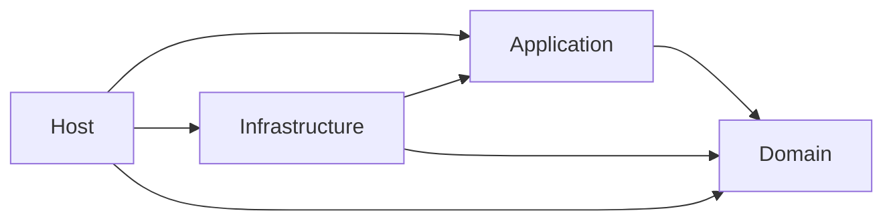

# ARCHITECTURE_AGENTS.md

## TL;DR

L0 NetArchTest suite that structurally enforces inward layer dependencies (NFR-090 / LADR-001). It is part of the **unit** level and must never require I/O or WireMock.

## Non-Negotiables

- Keep this project in the **unit** level (`run-level.sh unit`). Do not move it to component/integration.
- Reference **all four** layer assemblies so a Domain → Infrastructure edge is loadable and detectable.
- Failure messages must name the **rule** and the **offending types/assemblies** — never a bare "expected true".
- Do not treat a green run as proof of every architecture rule in the prose docs. Only the assertions listed under Key Behaviors are mechanical.

## System Context

NFR-090 requires layer dependency rules to be checked in the build. LADR-001 states clean-architecture dependencies point inward. This project is that check. It runs beside the other `*.UnitTest` projects in the PR gate's **Unit tests** step.

## Key Behaviors

### Enforced

| Rule | Mechanism |
|---|---|
| Domain ↛ Application, Infrastructure, Host | NetArchTest `ShouldNot().HaveDependencyOnAny(...)` |
| Domain's only non-BCL external assembly is NodaTime | Assembly reference allow-list on `DomainAssembly.GetReferencedAssemblies()` |
| Application ↛ Infrastructure, Host | NetArchTest |
| Infrastructure ↛ Host | NetArchTest |
| Host ↛ EF Core assemblies (no direct `DbContext` usage) | `NetArchTest.Rules.Types.InAssembly(HostAssembly).ShouldNot().HaveDependencyOn("Microsoft.EntityFrameworkCore")` (NetArchTest's `NamespaceTree` matches by namespace segment, so this also covers `Microsoft.EntityFrameworkCore.Relational` and `.Sqlite`) |

### Not mechanically enforced

- Vertical-slice folder shape inside Application (`Features/<Name>/`).
- "No business rules in Infrastructure" beyond assembly edges.
- Host endpoints must go through Mediator (no endpoints exist yet; when they do, prefer review + targeted tests over brittle reflection).
- Package versions / central package management hygiene.

## Test References

- L0: `tests/SmoothAiStockAnalysis.Architecture.UnitTest/LayerBoundaryTests.cs`

## Quality Constraints

- Analyzer-clean under `TreatWarningsAsErrors=true` (PascalCase test method names; no CA1707 underscores).
- Excluded from product coverage instrumentation via the narrowed Include filter in `common.sh`.

## Changelog

| Date | Change | Ref |
|:-----|:-------|:----|
| 2026-07-25 | Created — NetArchTest layer boundary suite for NFR-090 | #83 / WT-10-02 |
